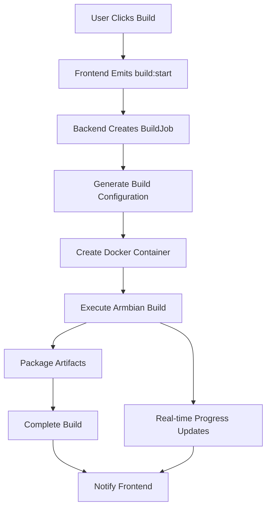

# BBOS Build System Documentation

## Overview

The BBOS Build System provides a comprehensive, cloud-based Armbian image building solution. It converts JSON configuration files into actual Armbian Linux images through a sophisticated build pipeline that includes Docker containerization, real-time progress tracking, and artifact management.

## Architecture

### Components

1. **ArmbianBuilder Service** (`backend/src/services/armbianBuilder.ts`)
   - Converts JSON configurations to Armbian build scripts
   - Manages Docker-based build execution
   - Handles artifact generation and collection

2. **Build Queue Manager** (`backend/src/index.ts`)
   - Manages build job queuing and execution
   - Provides real-time status updates via Socket.io
   - Handles concurrent build limitations

3. **Frontend Integration** (`frontend/src/panels/ArmbianConfigEditor.tsx`)
   - Triggers builds from the configuration editor
   - Displays real-time build progress
   - Shows build logs and artifact downloads

## Build Flow



## Configuration Generation

The system generates several key files for each build:

### 1. Build Script (`build.sh`)
Main script that configures and executes the Armbian compilation:

```bash
#!/bin/bash
export BOARD="rock-5b"
export BRANCH="current" 
export RELEASE="bookworm"
export BUILD_MINIMAL="yes"
# ... additional configuration
./compile.sh BOARD="$BOARD" BRANCH="$BRANCH" # ...
```

### 2. Customization Script (`userpatches/customize-image/customize.sh`)
Handles user accounts, SSH, networking, and package management:

```bash
#!/bin/bash
# User account setup
useradd -m -s /bin/bash username
echo "username:password" | chpasswd
usermod -aG sudo username

# SSH configuration  
cp /etc/ssh/sshd_config /etc/ssh/sshd_config.backup
sed -i 's/PermitRootLogin yes/PermitRootLogin no/' /etc/ssh/sshd_config
systemctl enable ssh

# Network configuration
echo "hostname" > /etc/hostname
```

### 3. Configuration Backup (`config.json`)
Complete JSON configuration for reference and debugging.

## Build Phases

The build process goes through several phases with real-time updates:

1. **Queued** (0%) - Build job created and queued
2. **Initializing** (5%) - Setting up build environment
3. **Downloading** (20%) - Downloading dependencies and base images  
4. **Building** (50-75%) - Compiling kernel and building filesystem
5. **Packaging** (90%) - Creating and compressing final image
6. **Uploading** (95%) - Processing artifacts
7. **Completed** (100%) - Build finished successfully

## Artifact Management

Generated artifacts include:

- **Images**: `.img` files (main bootable images)
- **Logs**: `.log` files (build process logs)
- **Configs**: `.json` files (configuration backups)
- **Checksums**: `.sha`, `.md5` files (integrity verification)
- **Packages**: Package lists and metadata

### Artifact API

Download artifacts via REST API:
```
GET /api/builds/{buildId}/artifacts/{filename}
```

## Environment Configuration

Configure the build system via environment variables:

```bash
# Build directories
BUILD_DIR=/tmp/bbos-builds
WORK_DIR=/tmp/bbos-work

# Armbian repository
ARMBIAN_REPO=https://github.com/armbian/build.git

# Server configuration
PORT=3001
NODE_ENV=development
```

## Docker Integration

The system uses the official Armbian build environment:

```bash
docker run --rm --name bbos-build-{buildId} \
  -v {configDir}:/build-config:ro \
  -v {outputDir}:/output \
  -v {userpatches}:/armbian/userpatches \
  armbian/armbian-build:latest \
  bash -c "cd /armbian && /build-config/build.sh"
```

## Real-time Communication

### Socket.io Events

**Client to Server:**
- `build:start` - Start a new build
- `build:cancel` - Cancel active build
- `build:getLogs` - Request build logs

**Server to Client:**
- `build:update` - Real-time progress updates
- `build:completed` - Build finished successfully
- `build:failed` - Build encountered errors
- `build:cancelled` - Build was cancelled

### Event Data Structure

```typescript
interface BuildUpdate {
  id: string;
  status: string;
  progress: number;
  message: string;
  timestamp: string;
}
```

## Supported Configurations

### Board Families
- `rockchip64` - Rock Pi, Orange Pi 5, etc.
- `rk35xx` - RK3588/RK3568 boards
- `sunxi` - Allwinner H3/H5/H6 boards
- `meson64` - Amlogic S905/S922 boards
- `bcm2711` - Raspberry Pi 4
- `odroidxu4` - Odroid XU4

### Distribution Options
- **Releases**: bookworm, bullseye, jammy, noble
- **Types**: minimal, desktop, server
- **Desktop Environments**: gnome, kde, xfce, cinnamon, mate

### Advanced Features
- Custom kernel parameters
- Device tree overlays
- Package management
- User account creation
- SSH configuration
- Wi-Fi setup
- Hostname configuration

## Error Handling

The system includes comprehensive error handling:

1. **Configuration Validation** - JSON schema validation
2. **Build Failures** - Graceful error reporting
3. **Timeout Management** - Build time limits
4. **Resource Cleanup** - Automatic cleanup of failed builds
5. **Queue Management** - Failed job removal from queue

## Performance Considerations

- **Concurrent Builds**: Limited to 3 simultaneous builds
- **Caching**: Docker layer caching for faster builds
- **Cleanup**: Automatic cleanup of old build files
- **Resource Monitoring**: Build resource usage tracking

## Development Testing

Test the build system programmatically:

```javascript
import { io } from 'socket.io-client';

const socket = io('http://localhost:3001');

socket.on('connect', () => {
  socket.emit('build:start', {
    config: {
      name: 'Test Build',
      board: { family: 'rockchip64', name: 'rock-5b', architecture: 'arm64' },
      distribution: { release: 'bookworm', type: 'minimal' }
    }
  });
});

socket.on('build:update', (data) => {
  console.log(`${data.status} (${data.progress}%): ${data.message}`);
});
```

## Security Considerations

1. **User Isolation** - All builds are user-scoped
2. **Input Validation** - Comprehensive configuration validation
3. **Container Isolation** - Docker containerization for build safety
4. **File Access Control** - Restricted file system access
5. **Rate Limiting** - API request rate limiting

## Troubleshooting

### Common Issues

1. **Docker Not Available**
   ```bash
   Error: Docker command failed
   Solution: Ensure Docker is installed and running
   ```

2. **Build Directory Permissions**
   ```bash
   Error: Permission denied creating build directory
   Solution: Check BUILD_DIR permissions
   ```

3. **Port Conflicts**
   ```bash
   Error: EADDRINUSE :::3001
   Solution: Change PORT environment variable
   ```

### Debug Mode

Enable verbose logging:
```bash
NODE_ENV=development npm run dev
```

## Future Enhancements

- [ ] Build caching and incremental builds
- [ ] Multi-architecture cross-compilation
- [ ] Build scheduling and queuing improvements
- [ ] Integration with external storage (S3, etc.)
- [ ] Build metrics and analytics
- [ ] Automated testing of generated images 