# Data Flow Architecture

## Overview

This document describes how data flows through the BBOS (Building Board Operating System) platform, from user interactions to build completion. Understanding these flows is crucial for debugging, optimization, and extending the system.

## High-Level Data Flow

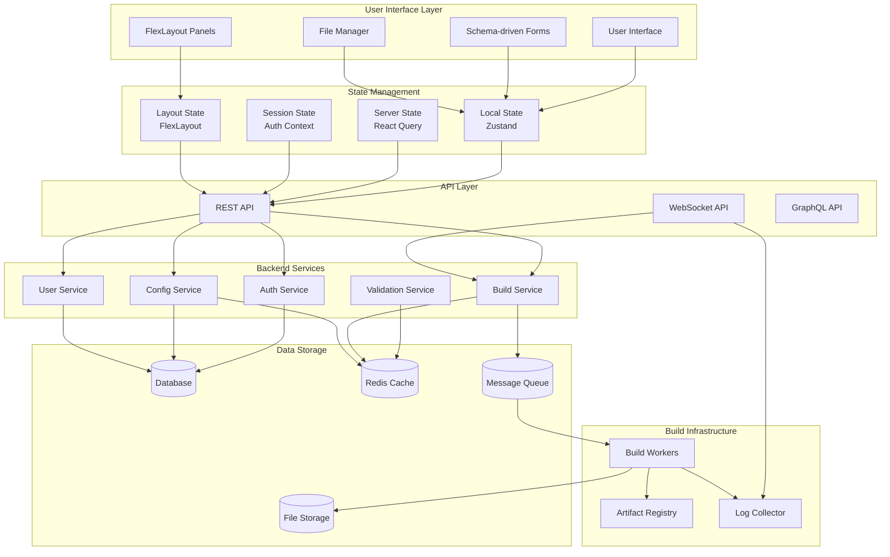
```mermaid
flowchart TD
    subgraph "User Interface Layer"
        UI[User Interface]
        Forms[Schema-driven Forms]
        Panels[FlexLayout Panels]
        FileManager[File Manager]
    end
    
    subgraph "State Management"
        LocalState[Local State<br/>Zustand]
        ServerState[Server State<br/>React Query]
        SessionState[Session State<br/>Auth Context]
        LayoutState[Layout State<br/>FlexLayout]
    end
    
    subgraph "API Layer"
        RestAPI[REST API]
        WebSocket[WebSocket API]
        GraphQL[GraphQL API]
    end
    
    subgraph "Backend Services"
        AuthService[Auth Service]
        ConfigService[Config Service]
        BuildService[Build Service]
        UserService[User Service]
        ValidationService[Validation Service]
    end
    
    subgraph "Data Storage"
        Database[(Database)]
        FileStorage[(File Storage)]
        Cache[(Redis Cache)]
        Queue[(Message Queue)]
    end
    
    subgraph "Build Infrastructure"
        BuildWorkers[Build Workers]
        ArtifactRegistry[Artifact Registry]
        LogCollector[Log Collector]
    end
    
    UI --> LocalState
    Forms --> LocalState
    Panels --> LayoutState
    FileManager --> LocalState
    
    LocalState --> RestAPI
    ServerState --> RestAPI
    SessionState --> RestAPI
    LayoutState --> RestAPI
    
    RestAPI --> AuthService
    RestAPI --> ConfigService
    RestAPI --> BuildService
    RestAPI --> UserService
    
    WebSocket --> BuildService
    WebSocket --> LogCollector
    
    AuthService --> Database
    ConfigService --> Database
    BuildService --> Queue
    UserService --> Database
    ValidationService --> Cache
    
    Queue --> BuildWorkers
    BuildWorkers --> ArtifactRegistry
    BuildWorkers --> LogCollector
    BuildWorkers --> FileStorage
    
    BuildService --> Cache
    ConfigService --> Cache
```

## Configuration Data Flow

### 1. Configuration Creation Flow

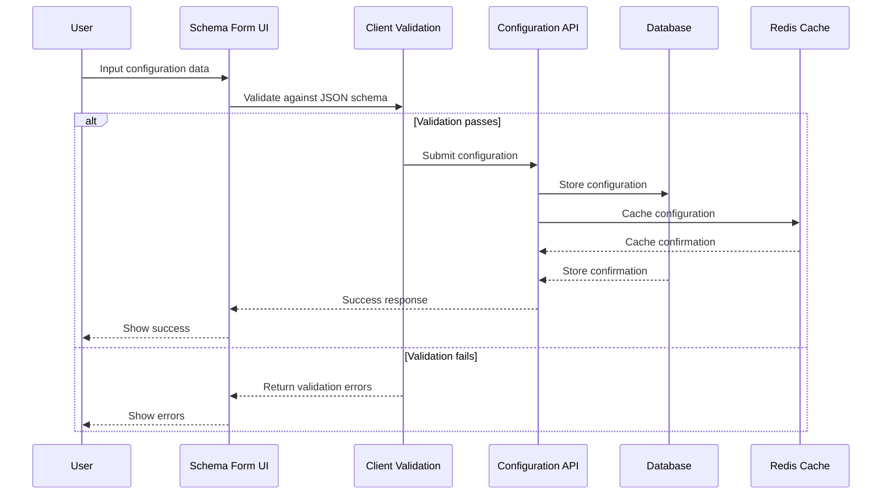
```mermaid
sequenceDiagram
    participant User
    participant UI as Schema Form UI
    participant Validation as Client Validation
    participant API as Configuration API
    participant DB as Database
    participant Cache as Redis Cache
    
    User->>UI: Input configuration data
    UI->>Validation: Validate against JSON schema
    
    alt Validation passes
        Validation->>API: Submit configuration
        API->>DB: Store configuration
        API->>Cache: Cache configuration
        Cache-->>API: Cache confirmation
        DB-->>API: Store confirmation
        API-->>UI: Success response
        UI-->>User: Show success
    else Validation fails
        Validation-->>UI: Return validation errors
        UI-->>User: Show errors
    end
```

### 2. Configuration Update Flow

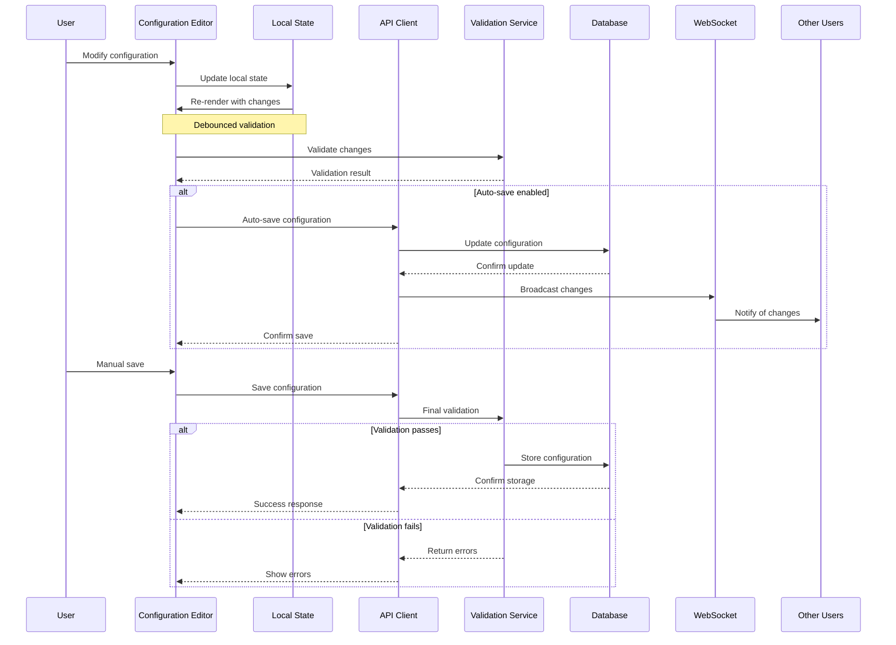
```mermaid
sequenceDiagram
    participant User
    participant UI as Configuration Editor
    participant State as Local State
    participant API as API Client
    participant Validation as Validation Service
    participant DB as Database
    participant WS as WebSocket
    participant OtherUsers as Other Users
    
    User->>UI: Modify configuration
    UI->>State: Update local state
    State->>UI: Re-render with changes
    
    Note over UI,State: Debounced validation
    UI->>Validation: Validate changes
    Validation-->>UI: Validation result
    
    alt Auto-save enabled
        UI->>API: Auto-save configuration
        API->>DB: Update configuration
        DB-->>API: Confirm update
        API->>WS: Broadcast changes
        WS->>OtherUsers: Notify of changes
        API-->>UI: Confirm save
    end
    
    User->>UI: Manual save
    UI->>API: Save configuration
    API->>Validation: Final validation
    
    alt Validation passes
        Validation->>DB: Store configuration
        DB-->>API: Confirm storage
        API-->>UI: Success response
    else Validation fails
        Validation-->>API: Return errors
        API-->>UI: Show errors
    end
```

### 3. Real-time Collaboration Flow

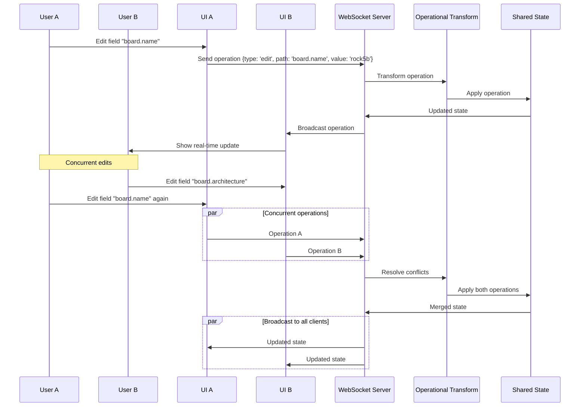
```mermaid
sequenceDiagram
    participant UserA as User A
    participant UserB as User B
    participant UIa as UI A
    participant UIb as UI B
    participant WS as WebSocket Server
    participant OT as Operational Transform
    participant State as Shared State
    
    UserA->>UIa: Edit field "board.name"
    UIa->>WS: Send operation {type: 'edit', path: 'board.name', value: 'rock5b'}
    WS->>OT: Transform operation
    OT->>State: Apply operation
    State->>WS: Updated state
    WS->>UIb: Broadcast operation
    UIb->>UserB: Show real-time update
    
    Note over UserA,UserB: Concurrent edits
    UserB->>UIb: Edit field "board.architecture"
    UserA->>UIa: Edit field "board.name" again
    
    par Concurrent operations
        UIa->>WS: Operation A
        UIb->>WS: Operation B
    end
    
    WS->>OT: Resolve conflicts
    OT->>State: Apply both operations
    State->>WS: Merged state
    
    par Broadcast to all clients
        WS->>UIa: Updated state
        WS->>UIb: Updated state
    end
```

## Build Process Data Flow

### 1. Build Initiation Flow

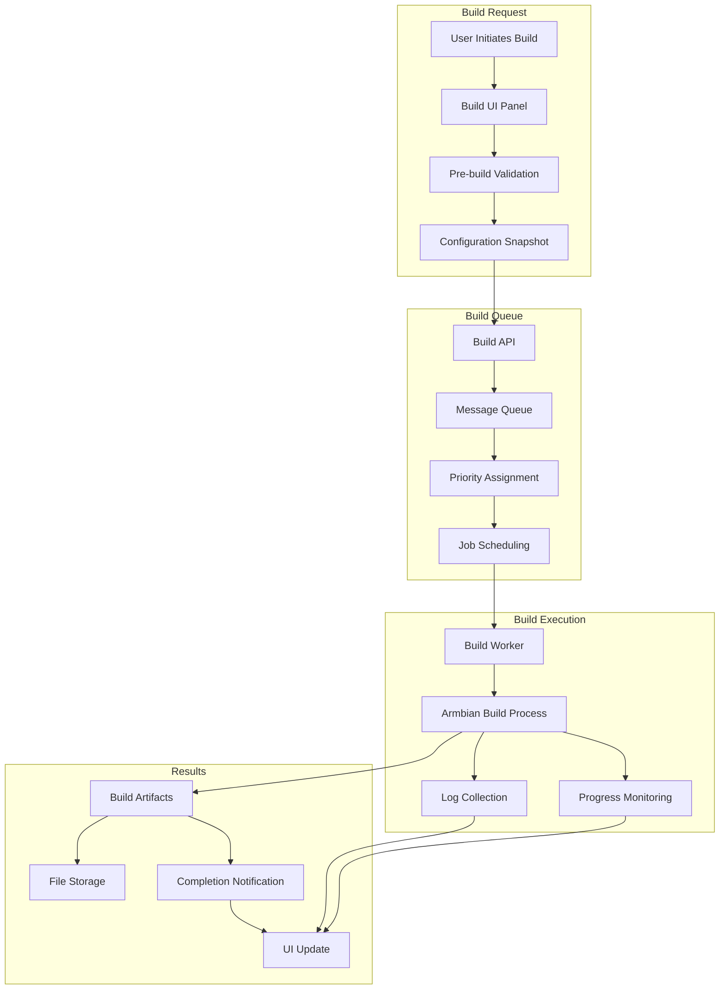
```mermaid
flowchart TD
    subgraph "Build Request"
        User[User Initiates Build]
        UI[Build UI Panel]
        Validation[Pre-build Validation]
        Config[Configuration Snapshot]
    end
    
    subgraph "Build Queue"
        API[Build API]
        Queue[Message Queue]
        Priority[Priority Assignment]
        Scheduling[Job Scheduling]
    end
    
    subgraph "Build Execution"
        Worker[Build Worker]
        ArmBuild[Armbian Build Process]
        Monitoring[Progress Monitoring]
        Logging[Log Collection]
    end
    
    subgraph "Results"
        Artifacts[Build Artifacts]
        Storage[File Storage]
        Notification[Completion Notification]
        UI2[UI Update]
    end
    
    User --> UI
    UI --> Validation
    Validation --> Config
    Config --> API
    
    API --> Queue
    Queue --> Priority
    Priority --> Scheduling
    Scheduling --> Worker
    
    Worker --> ArmBuild
    ArmBuild --> Monitoring
    ArmBuild --> Logging
    
    Monitoring --> UI2
    Logging --> UI2
    ArmBuild --> Artifacts
    Artifacts --> Storage
    Artifacts --> Notification
    Notification --> UI2
```

### 2. Real-time Build Monitoring Flow

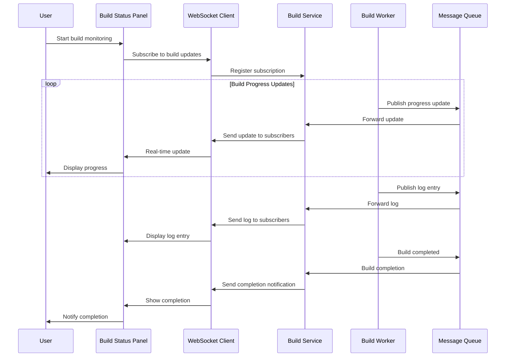
```mermaid
sequenceDiagram
    participant User
    participant BuildPanel as Build Status Panel
    participant WebSocket as WebSocket Client
    participant BuildService as Build Service
    participant Worker as Build Worker
    participant Queue as Message Queue
    
    User->>BuildPanel: Start build monitoring
    BuildPanel->>WebSocket: Subscribe to build updates
    WebSocket->>BuildService: Register subscription
    
    loop Build Progress Updates
        Worker->>Queue: Publish progress update
        Queue->>BuildService: Forward update
        BuildService->>WebSocket: Send update to subscribers
        WebSocket->>BuildPanel: Real-time update
        BuildPanel->>User: Display progress
    end
    
    Worker->>Queue: Publish log entry
    Queue->>BuildService: Forward log
    BuildService->>WebSocket: Send log to subscribers
    WebSocket->>BuildPanel: Display log entry
    
    Worker->>Queue: Build completed
    Queue->>BuildService: Build completion
    BuildService->>WebSocket: Send completion notification
    WebSocket->>BuildPanel: Show completion
    BuildPanel->>User: Notify completion
```

### 3. Build Artifact Flow

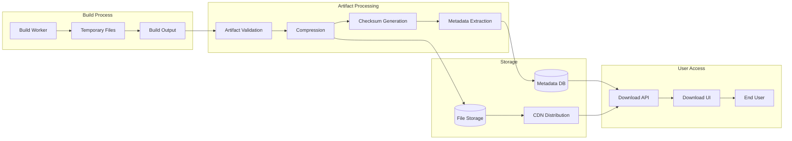
```mermaid
flowchart LR
    subgraph "Build Process"
        Worker[Build Worker]
        TempFiles[Temporary Files]
        BuildOutput[Build Output]
    end
    
    subgraph "Artifact Processing"
        Validation[Artifact Validation]
        Compression[Compression]
        Checksum[Checksum Generation]
        Metadata[Metadata Extraction]
    end
    
    subgraph "Storage"
        FileStorage[(File Storage)]
        Database[(Metadata DB)]
        CDN[CDN Distribution]
    end
    
    subgraph "User Access"
        DownloadAPI[Download API]
        UI[Download UI]
        User[End User]
    end
    
    Worker --> TempFiles
    TempFiles --> BuildOutput
    BuildOutput --> Validation
    
    Validation --> Compression
    Compression --> Checksum
    Checksum --> Metadata
    
    Metadata --> Database
    Compression --> FileStorage
    FileStorage --> CDN
    
    Database --> DownloadAPI
    CDN --> DownloadAPI
    DownloadAPI --> UI
    UI --> User
```

## User Authentication & Authorization Flow

### 1. Social Login Flow

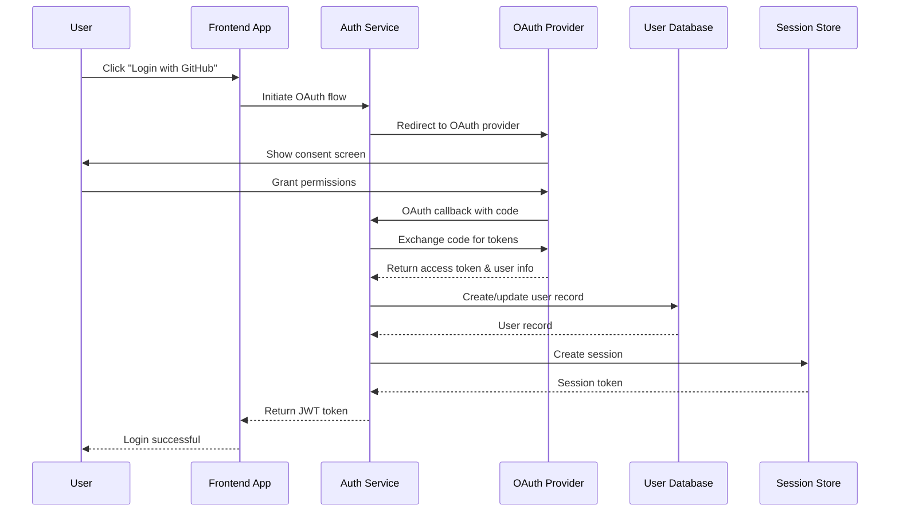
```mermaid
sequenceDiagram
    participant User
    participant Frontend as Frontend App
    participant AuthService as Auth Service
    participant Provider as OAuth Provider
    participant Database as User Database
    participant Session as Session Store
    
    User->>Frontend: Click "Login with GitHub"
    Frontend->>AuthService: Initiate OAuth flow
    AuthService->>Provider: Redirect to OAuth provider
    Provider->>User: Show consent screen
    User->>Provider: Grant permissions
    Provider->>AuthService: OAuth callback with code
    AuthService->>Provider: Exchange code for tokens
    Provider-->>AuthService: Return access token & user info
    
    AuthService->>Database: Create/update user record
    Database-->>AuthService: User record
    AuthService->>Session: Create session
    Session-->>AuthService: Session token
    AuthService-->>Frontend: Return JWT token
    Frontend-->>User: Login successful
```

### 2. Data Access Authorization Flow

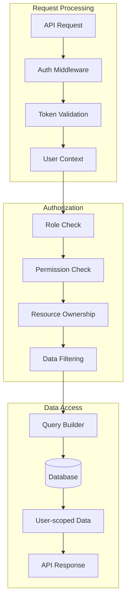
```mermaid
flowchart TD
    subgraph "Request Processing"
        Request[API Request]
        AuthMiddleware[Auth Middleware]
        TokenValidation[Token Validation]
        UserContext[User Context]
    end
    
    subgraph "Authorization"
        RoleCheck[Role Check]
        PermissionCheck[Permission Check]
        ResourceOwnership[Resource Ownership]
        DataFiltering[Data Filtering]
    end
    
    subgraph "Data Access"
        QueryBuilder[Query Builder]
        Database[(Database)]
        UserScopedData[User-scoped Data]
        Response[API Response]
    end
    
    Request --> AuthMiddleware
    AuthMiddleware --> TokenValidation
    TokenValidation --> UserContext
    
    UserContext --> RoleCheck
    RoleCheck --> PermissionCheck
    PermissionCheck --> ResourceOwnership
    ResourceOwnership --> DataFiltering
    
    DataFiltering --> QueryBuilder
    QueryBuilder --> Database
    Database --> UserScopedData
    UserScopedData --> Response
```

## Schema Validation Flow

### 1. Client-side Validation Flow

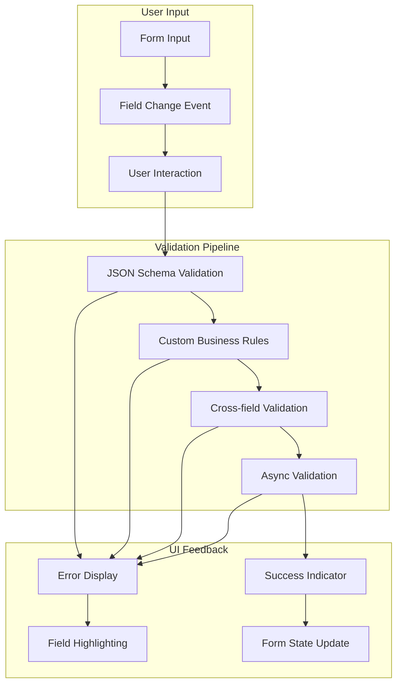
```mermaid
flowchart TD
    subgraph "User Input"
        FormInput[Form Input]
        FieldChange[Field Change Event]
        UserInteraction[User Interaction]
    end
    
    subgraph "Validation Pipeline"
        SchemaValidation[JSON Schema Validation]
        CustomValidation[Custom Business Rules]
        CrossFieldValidation[Cross-field Validation]
        AsyncValidation[Async Validation]
    end
    
    subgraph "UI Feedback"
        ErrorDisplay[Error Display]
        SuccessIndicator[Success Indicator]
        FieldHighlight[Field Highlighting]
        FormState[Form State Update]
    end
    
    FormInput --> FieldChange
    FieldChange --> UserInteraction
    UserInteraction --> SchemaValidation
    
    SchemaValidation --> CustomValidation
    CustomValidation --> CrossFieldValidation
    CrossFieldValidation --> AsyncValidation
    
    SchemaValidation --> ErrorDisplay
    CustomValidation --> ErrorDisplay
    CrossFieldValidation --> ErrorDisplay
    AsyncValidation --> ErrorDisplay
    
    AsyncValidation --> SuccessIndicator
    ErrorDisplay --> FieldHighlight
    SuccessIndicator --> FormState
```

### 2. Server-side Validation Flow

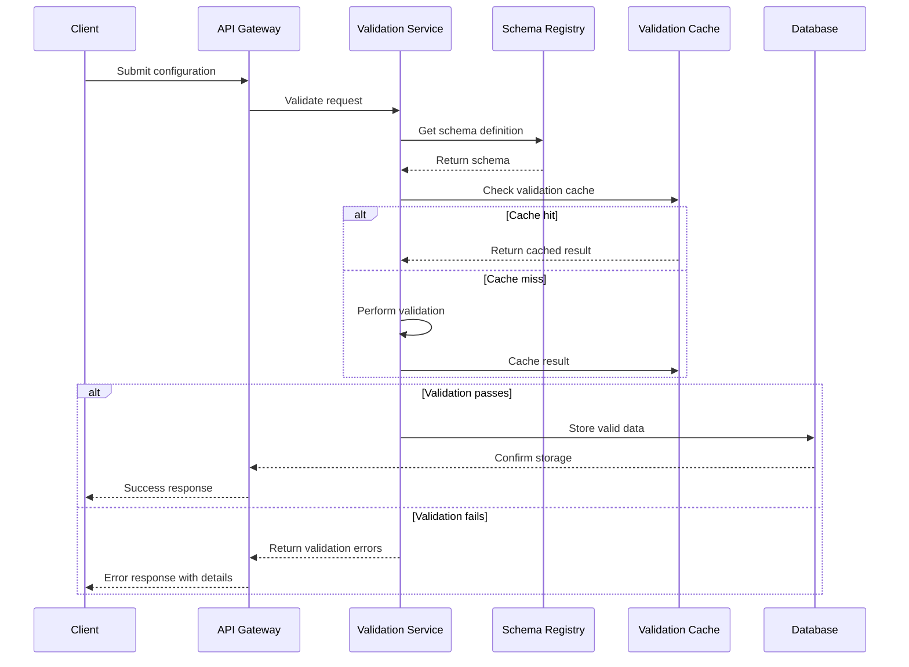
```mermaid
sequenceDiagram
    participant Client
    participant API as API Gateway
    participant Validation as Validation Service
    participant Schema as Schema Registry
    participant Cache as Validation Cache
    participant Database as Database
    
    Client->>API: Submit configuration
    API->>Validation: Validate request
    Validation->>Schema: Get schema definition
    Schema-->>Validation: Return schema
    
    Validation->>Cache: Check validation cache
    alt Cache hit
        Cache-->>Validation: Return cached result
    else Cache miss
        Validation->>Validation: Perform validation
        Validation->>Cache: Cache result
    end
    
    alt Validation passes
        Validation->>Database: Store valid data
        Database-->>API: Confirm storage
        API-->>Client: Success response
    else Validation fails
        Validation-->>API: Return validation errors
        API-->>Client: Error response with details
    end
```

## Error Handling & Logging Flow

### 1. Error Propagation Flow

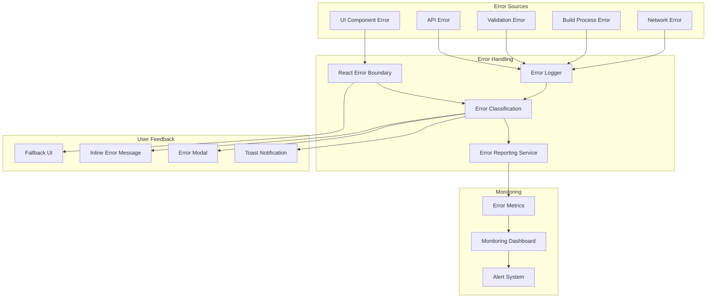
```mermaid
flowchart TD
    subgraph "Error Sources"
        UIError[UI Component Error]
        APIError[API Error]
        ValidationError[Validation Error]
        BuildError[Build Process Error]
        NetworkError[Network Error]
    end
    
    subgraph "Error Handling"
        ErrorBoundary[React Error Boundary]
        ErrorLogger[Error Logger]
        ErrorClassification[Error Classification]
        ErrorReporting[Error Reporting Service]
    end
    
    subgraph "User Feedback"
        Toast[Toast Notification]
        Modal[Error Modal]
        InlineError[Inline Error Message]
        Fallback[Fallback UI]
    end
    
    subgraph "Monitoring"
        Metrics[Error Metrics]
        Dashboard[Monitoring Dashboard]
        Alerts[Alert System]
    end
    
    UIError --> ErrorBoundary
    APIError --> ErrorLogger
    ValidationError --> ErrorLogger
    BuildError --> ErrorLogger
    NetworkError --> ErrorLogger
    
    ErrorBoundary --> ErrorClassification
    ErrorLogger --> ErrorClassification
    ErrorClassification --> ErrorReporting
    
    ErrorClassification --> Toast
    ErrorClassification --> Modal
    ErrorClassification --> InlineError
    ErrorBoundary --> Fallback
    
    ErrorReporting --> Metrics
    Metrics --> Dashboard
    Dashboard --> Alerts
```

### 2. Logging & Observability Flow

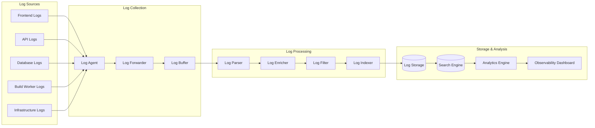
```mermaid
flowchart LR
    subgraph "Log Sources"
        Frontend[Frontend Logs]
        API[API Logs]
        Database[Database Logs]
        BuildWorker[Build Worker Logs]
        Infrastructure[Infrastructure Logs]
    end
    
    subgraph "Log Collection"
        LogAgent[Log Agent]
        LogForwarder[Log Forwarder]
        LogBuffer[Log Buffer]
    end
    
    subgraph "Log Processing"
        LogParser[Log Parser]
        LogEnricher[Log Enricher]
        LogFilter[Log Filter]
        LogIndexer[Log Indexer]
    end
    
    subgraph "Storage & Analysis"
        LogStorage[(Log Storage)]
        SearchEngine[(Search Engine)]
        Analytics[Analytics Engine]
        Dashboard[Observability Dashboard]
    end
    
    Frontend --> LogAgent
    API --> LogAgent
    Database --> LogAgent
    BuildWorker --> LogAgent
    Infrastructure --> LogAgent
    
    LogAgent --> LogForwarder
    LogForwarder --> LogBuffer
    LogBuffer --> LogParser
    
    LogParser --> LogEnricher
    LogEnricher --> LogFilter
    LogFilter --> LogIndexer
    
    LogIndexer --> LogStorage
    LogStorage --> SearchEngine
    SearchEngine --> Analytics
    Analytics --> Dashboard
```

## Performance & Caching Flow

### 1. Multi-level Caching Strategy

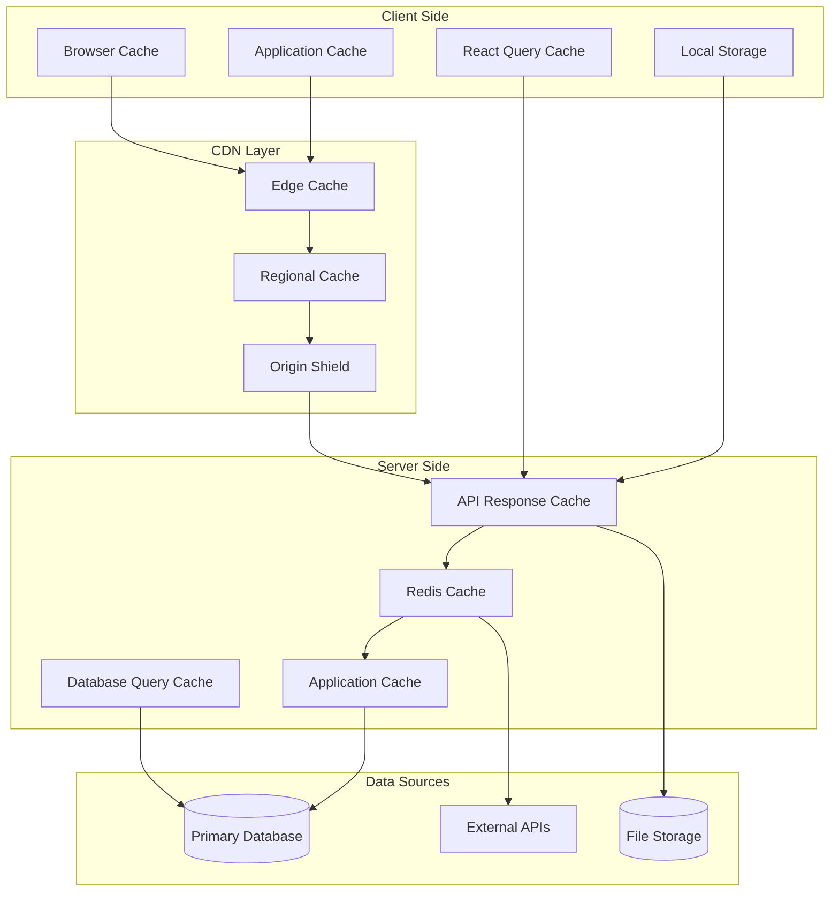
```mermaid
flowchart TD
    subgraph "Client Side"
        BrowserCache[Browser Cache]
        AppCache[Application Cache]
        QueryCache[React Query Cache]
        LocalStorage[Local Storage]
    end
    
    subgraph "CDN Layer"
        EdgeCache[Edge Cache]
        RegionalCache[Regional Cache]
        OriginShield[Origin Shield]
    end
    
    subgraph "Server Side"
        APICache[API Response Cache]
        DatabaseCache[Database Query Cache]
        RedisCache[Redis Cache]
        ApplicationCache[Application Cache]
    end
    
    subgraph "Data Sources"
        Database[(Primary Database)]
        FileStorage[(File Storage)]
        ExternalAPI[External APIs]
    end
    
    BrowserCache --> EdgeCache
    AppCache --> EdgeCache
    QueryCache --> APICache
    LocalStorage --> APICache
    
    EdgeCache --> RegionalCache
    RegionalCache --> OriginShield
    OriginShield --> APICache
    
    APICache --> RedisCache
    DatabaseCache --> Database
    RedisCache --> ApplicationCache
    ApplicationCache --> Database
    
    APICache --> FileStorage
    RedisCache --> ExternalAPI
```

### 2. Cache Invalidation Flow

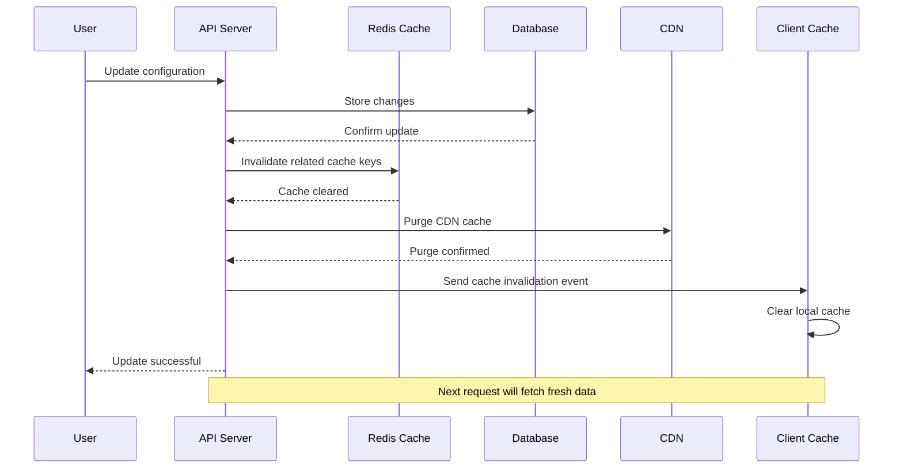
```mermaid
sequenceDiagram
    participant User
    participant API as API Server
    participant Cache as Redis Cache
    participant Database as Database
    participant CDN as CDN
    participant Client as Client Cache
    
    User->>API: Update configuration
    API->>Database: Store changes
    Database-->>API: Confirm update
    
    API->>Cache: Invalidate related cache keys
    Cache-->>API: Cache cleared
    
    API->>CDN: Purge CDN cache
    CDN-->>API: Purge confirmed
    
    API->>Client: Send cache invalidation event
    Client->>Client: Clear local cache
    
    API-->>User: Update successful
    
    Note over API,Client: Next request will fetch fresh data
```

## Security Data Flow

### 1. Data Encryption Flow

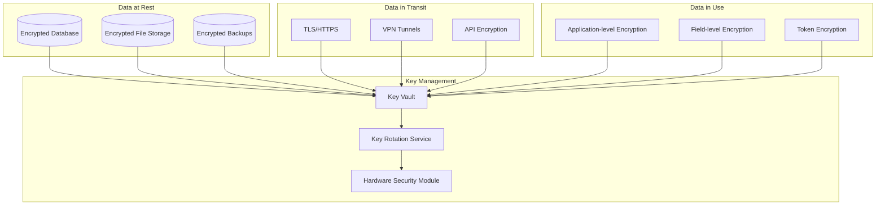
```mermaid
flowchart TD
    subgraph "Data at Rest"
        Database[(Encrypted Database)]
        FileStorage[(Encrypted File Storage)]
        BackupStorage[(Encrypted Backups)]
    end
    
    subgraph "Data in Transit"
        TLS[TLS/HTTPS]
        VPN[VPN Tunnels]
        APIEncryption[API Encryption]
    end
    
    subgraph "Data in Use"
        ApplicationLevel[Application-level Encryption]
        FieldLevel[Field-level Encryption]
        TokenEncryption[Token Encryption]
    end
    
    subgraph "Key Management"
        KeyVault[Key Vault]
        RotationService[Key Rotation Service]
        HSM[Hardware Security Module]
    end
    
    Database --> KeyVault
    FileStorage --> KeyVault
    BackupStorage --> KeyVault
    
    TLS --> KeyVault
    VPN --> KeyVault
    APIEncryption --> KeyVault
    
    ApplicationLevel --> KeyVault
    FieldLevel --> KeyVault
    TokenEncryption --> KeyVault
    
    KeyVault --> RotationService
    RotationService --> HSM
```

### 2. Audit Trail Flow

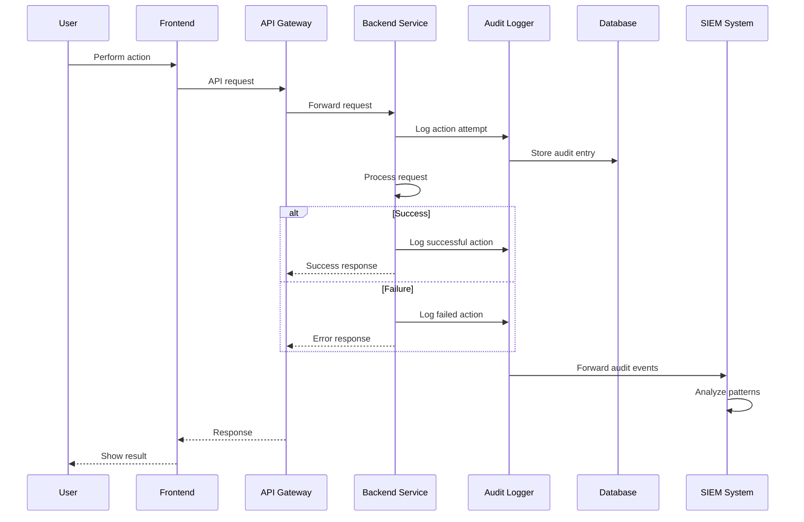
```mermaid
sequenceDiagram
    participant User
    participant Frontend as Frontend
    participant API as API Gateway
    participant Service as Backend Service
    participant AuditLog as Audit Logger
    participant Database as Database
    participant SIEM as SIEM System
    
    User->>Frontend: Perform action
    Frontend->>API: API request
    API->>Service: Forward request
    
    Service->>AuditLog: Log action attempt
    AuditLog->>Database: Store audit entry
    
    Service->>Service: Process request
    
    alt Success
        Service->>AuditLog: Log successful action
        Service-->>API: Success response
    else Failure
        Service->>AuditLog: Log failed action
        Service-->>API: Error response
    end
    
    AuditLog->>SIEM: Forward audit events
    SIEM->>SIEM: Analyze patterns
    
    API-->>Frontend: Response
    Frontend-->>User: Show result
```

## Data Consistency & Synchronization

### 1. Eventual Consistency Flow

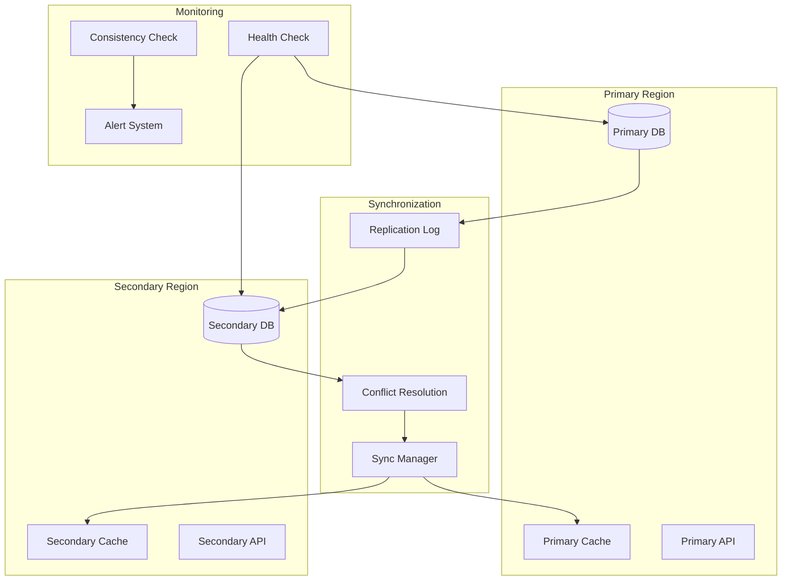
```mermaid
flowchart TD
    subgraph "Primary Region"
        PrimaryDB[(Primary DB)]
        PrimaryCache[Primary Cache]
        PrimaryAPI[Primary API]
    end
    
    subgraph "Secondary Region"
        SecondaryDB[(Secondary DB)]
        SecondaryCache[Secondary Cache]
        SecondaryAPI[Secondary API]
    end
    
    subgraph "Synchronization"
        ReplicationLog[Replication Log]
        ConflictResolution[Conflict Resolution]
        SyncManager[Sync Manager]
    end
    
    subgraph "Monitoring"
        HealthCheck[Health Check]
        ConsistencyCheck[Consistency Check]
        AlertSystem[Alert System]
    end
    
    PrimaryDB --> ReplicationLog
    ReplicationLog --> SecondaryDB
    SecondaryDB --> ConflictResolution
    ConflictResolution --> SyncManager
    
    SyncManager --> PrimaryCache
    SyncManager --> SecondaryCache
    
    HealthCheck --> PrimaryDB
    HealthCheck --> SecondaryDB
    ConsistencyCheck --> AlertSystem
```

### 2. Real-time Synchronization Flow

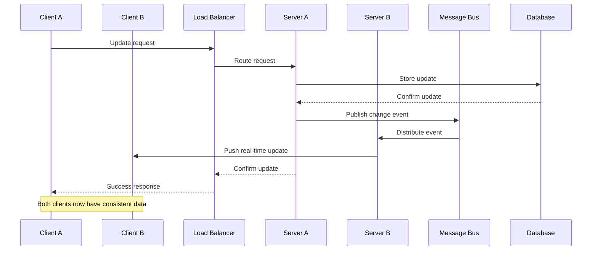
```mermaid
sequenceDiagram
    participant ClientA as Client A
    participant ClientB as Client B
    participant LoadBalancer as Load Balancer
    participant ServerA as Server A
    participant ServerB as Server B
    participant MessageBus as Message Bus
    participant Database as Database
    
    ClientA->>LoadBalancer: Update request
    LoadBalancer->>ServerA: Route request
    ServerA->>Database: Store update
    Database-->>ServerA: Confirm update
    
    ServerA->>MessageBus: Publish change event
    MessageBus->>ServerB: Distribute event
    ServerB->>ClientB: Push real-time update
    
    ServerA-->>LoadBalancer: Confirm update
    LoadBalancer-->>ClientA: Success response
    
    Note over ClientA,ClientB: Both clients now have consistent data
```

## Conclusion

This data flow architecture ensures:

- **Scalable Data Processing**: Efficient handling of large volumes of configuration and build data
- **Real-time Collaboration**: Seamless multi-user editing with conflict resolution
- **Robust Error Handling**: Comprehensive error tracking and user feedback
- **Security**: End-to-end encryption and audit trails
- **Performance**: Multi-level caching and optimization strategies
- **Reliability**: Data consistency and synchronization across services

Understanding these flows enables:
- **Debugging**: Tracing issues through the system
- **Optimization**: Identifying bottlenecks and performance improvements
- **Extension**: Adding new features while maintaining data integrity
- **Monitoring**: Setting up appropriate observability and alerting

The data flow patterns established here serve as the foundation for the BBOS platform while providing reusable patterns for other complex distributed systems.