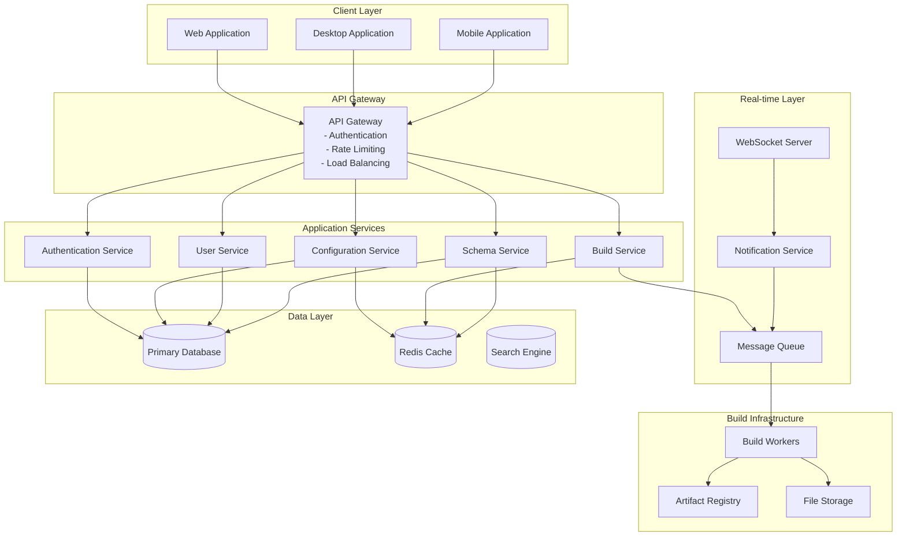
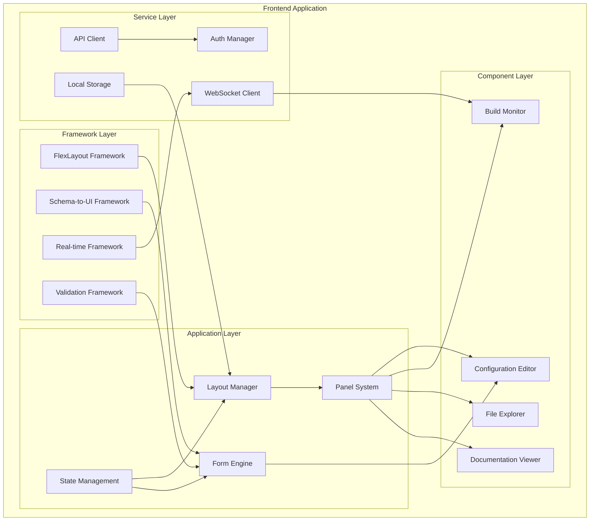
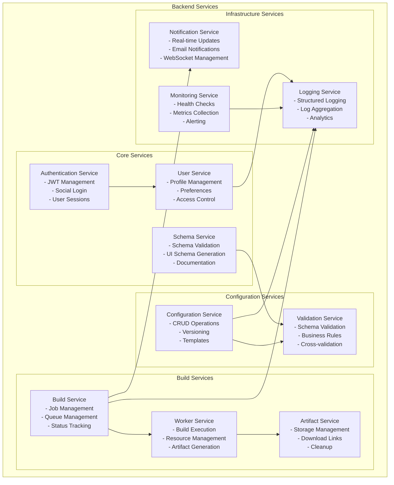
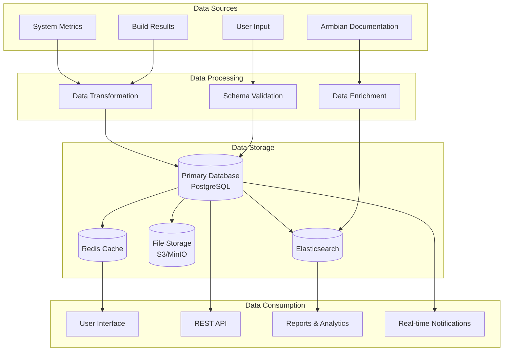
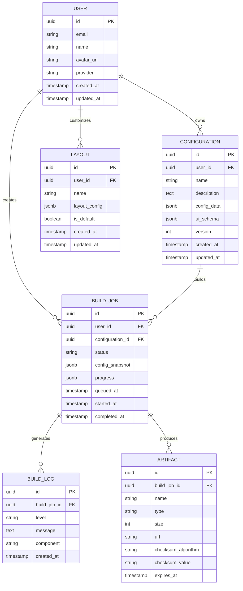
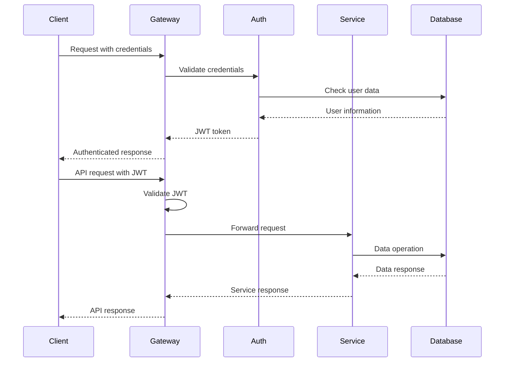
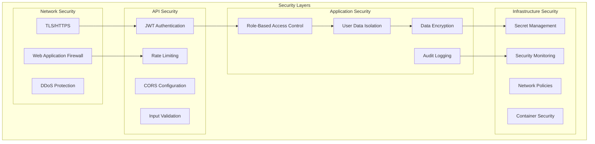
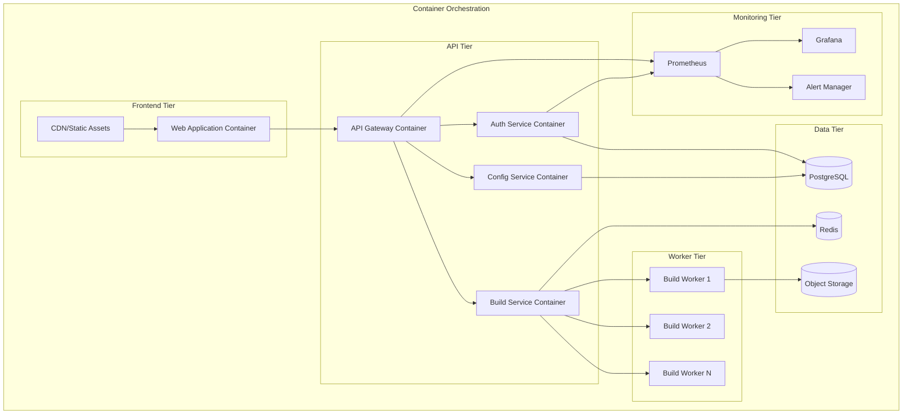
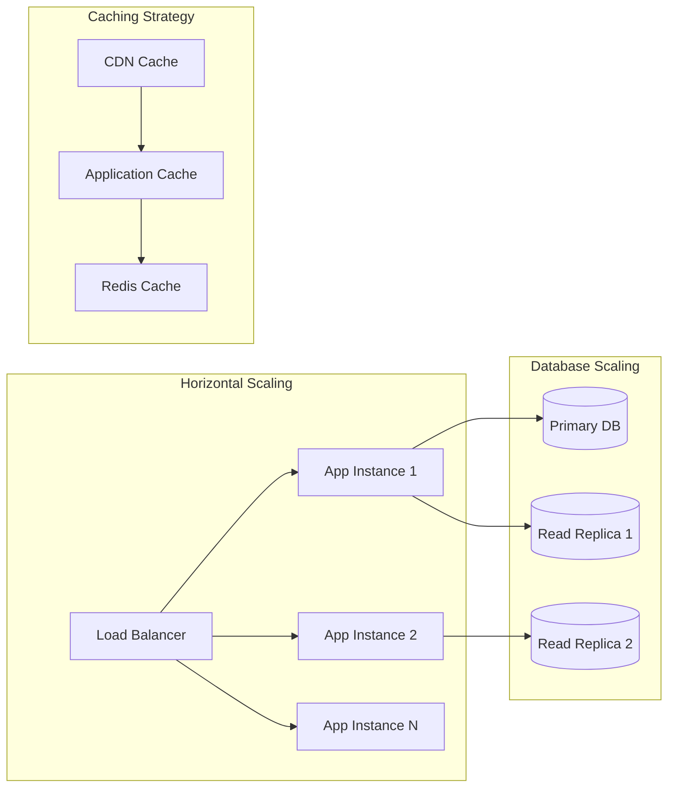
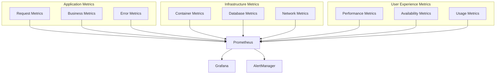

# System Architecture

## Overview

BBOS (Building Board Operating System) is a cloud-based IoT platform designed with a microservices architecture that supports real-time collaboration, schema-driven development, and extensible build pipelines.

## High-Level Architecture

## Component Architecture

### Frontend Architecture

### Backend Architecture

## Data Architecture

### Data Flow Diagram

### Database Schema

## Security Architecture

### Authentication & Authorization Flow

### Security Layers

## Deployment Architecture

### Container Architecture

## Framework Extraction Opportunities

### 1. Schema-to-UI Framework
**Pattern**: Automatic UI generation from JSON Schema
**Reusability**: High - applicable to any JSON Schema-driven application
**Components**: Form generators, validation, custom widgets

### 2. IDE Layout Framework
**Pattern**: Flexible, persistent panel-based interfaces
**Reusability**: High - applicable to any complex web application
**Components**: Panel system, layout persistence, drag-and-drop

### 3. Real-time Collaboration Framework
**Pattern**: Multi-user real-time updates with conflict resolution
**Reusability**: Medium-High - applicable to collaborative applications
**Components**: WebSocket management, state synchronization, user presence

### 4. Build Pipeline Framework
**Pattern**: Extensible, monitored build and deployment pipelines
**Reusability**: High - applicable to any CI/CD system
**Components**: Job queue, worker management, artifact storage

### 5. Validation Framework
**Pattern**: Pluggable, schema-driven validation with custom rules
**Reusability**: High - applicable to any data validation scenario
**Components**: Validation engine, rule definitions, error handling

## Performance Considerations

### Scalability Patterns

### Caching Strategy

- **CDN**: Static assets, public documentation
- **Redis**: Session data, frequently accessed configurations
- **Application Cache**: Schema definitions, user preferences
- **Database Query Cache**: Common queries, lookup data

## Monitoring and Observability

### Metrics Collection

## Technology Stack Alignment

| Layer | Technology | Justification |
|-------|------------|---------------|
| Frontend | React + TypeScript | Type safety, component reusability |
| UI Framework | FlexLayout + MUI | IDE-style interface, professional components |
| State Management | Zustand + React Query | Simple state, server state caching |
| Backend | Node.js + TypeScript | Shared language, JSON-native |
| Database | PostgreSQL | ACID compliance, JSON support |
| Cache | Redis | Performance, session storage |
| Message Queue | Redis/Bull | Job processing, real-time updates |
| Container | Docker + Kubernetes | Scalability, deployment consistency |
| Monitoring | Prometheus + Grafana | Metrics collection, visualization |

## Next Steps

1. **Framework Extraction**: Identify and extract reusable patterns
2. **Component Development**: Build core framework components
3. **Integration Testing**: Test framework integration points
4. **Performance Optimization**: Implement caching and scaling strategies
5. **Security Hardening**: Implement security best practices

---

This architecture provides a solid foundation for both the BBOS application and the extracted frameworks that can benefit other projects in the ecosystem.