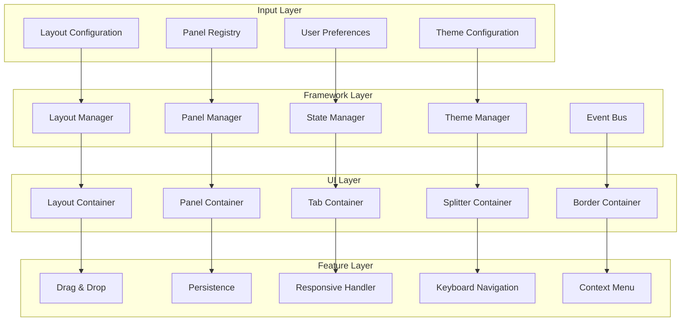
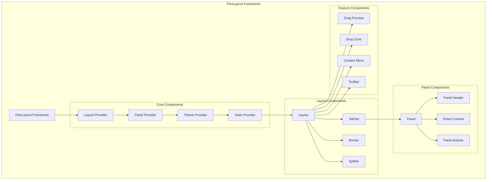

# FlexLayout Framework

## Overview

The FlexLayout Framework provides a comprehensive solution for creating IDE-style interfaces with dockable panels, persistent layouts, and customizable workspace management. Built on top of FlexLayout React, it extends the core functionality with enterprise-grade features for complex applications.

## Problem Statement

Creating sophisticated IDE-style interfaces requires:
- **Complex Layout Management**: Panels, tabs, splitters, and docking areas
- **State Persistence**: Remembering user layout preferences across sessions
- **Dynamic Content**: Adding/removing panels at runtime
- **Responsive Design**: Adapting to different screen sizes
- **Theme Integration**: Consistent styling across all UI elements
- **Accessibility**: Keyboard navigation and screen reader support

## Architecture Overview

### Core Framework Architecture



### Component Hierarchy



## API Design

### Core Framework Interface

```typescript
interface FlexLayoutFramework {
  // Layout management
  createLayout(config: LayoutConfig): LayoutManager;
  loadLayout(layoutId: string, storage: StorageProvider): Promise<LayoutManager>;
  saveLayout(layoutId: string, layout: LayoutManager, storage: StorageProvider): Promise<void>;
  
  // Panel management
  registerPanel(panelType: string, component: PanelComponent): void;
  unregisterPanel(panelType: string): void;
  createPanel(panelType: string, config: PanelConfig): Panel;
  
  // Theme management
  registerTheme(name: string, theme: LayoutTheme): void;
  setTheme(name: string): void;
  getTheme(name?: string): LayoutTheme;
  
  // Event management
  on(event: string, handler: EventHandler): void;
  off(event: string, handler: EventHandler): void;
  emit(event: string, data: any): void;
  
  // Persistence
  persistLayout(layoutId: string, config?: PersistenceConfig): Promise<void>;
  restoreLayout(layoutId: string, config?: PersistenceConfig): Promise<LayoutConfig>;
  
  // Responsive
  setBreakpoints(breakpoints: Breakpoints): void;
  getBreakpoint(): string;
}
```

### Layout Configuration

```typescript
interface LayoutConfig {
  global: {
    tabEnableClose?: boolean;
    tabEnableFloat?: boolean;
    tabEnableDrag?: boolean;
    tabEnableRename?: boolean;
    tabClassName?: string;
    tabIcon?: string;
    borderBarSize?: number;
    borderEnableAutoHide?: boolean;
  };
  
  borders?: BorderConfig[];
  layout: LayoutNode;
}

interface LayoutNode {
  type: 'row' | 'tabset' | 'tab';
  id?: string;
  weight?: number;
  width?: number;
  height?: number;
  selected?: number;
  children?: LayoutNode[];
  
  // Tab-specific properties
  name?: string;
  component?: string;
  config?: Record<string, any>;
  icon?: string;
  enableClose?: boolean;
  enableDrag?: boolean;
  enableRename?: boolean;
  className?: string;
}

interface BorderConfig {
  type: 'border';
  location: 'top' | 'bottom' | 'left' | 'right';
  size?: number;
  children: LayoutNode[];
  barSize?: number;
  enableAutoHide?: boolean;
}
```

### Panel System

```typescript
interface PanelComponent {
  (props: PanelProps): JSX.Element;
}

interface PanelProps {
  node: TabNode;
  layout: LayoutManager;
  
  // Panel configuration
  config?: Record<string, any>;
  data?: any;
  
  // Event handlers
  onClose?: () => void;
  onRename?: (newName: string) => void;
  onFloat?: () => void;
  onMaximize?: () => void;
  
  // Layout actions
  addPanel?: (panelConfig: PanelConfig) => void;
  removePanel?: (panelId: string) => void;
  activatePanel?: (panelId: string) => void;
  
  // State
  isActive?: boolean;
  isVisible?: boolean;
  isFloating?: boolean;
  isMaximized?: boolean;
}

interface PanelConfig {
  type: string;
  name: string;
  id?: string;
  icon?: string;
  component?: string;
  config?: Record<string, any>;
  enableClose?: boolean;
  enableDrag?: boolean;
  enableRename?: boolean;
  enableFloat?: boolean;
}
```

### Theme System

```typescript
interface LayoutTheme {
  name: string;
  version: string;
  
  // Colors
  colors: {
    background: string;
    border: string;
    tab: {
      background: string;
      backgroundActive: string;
      backgroundHover: string;
      text: string;
      textActive: string;
      border: string;
      borderActive: string;
    };
    panel: {
      background: string;
      header: string;
      text: string;
      border: string;
    };
    splitter: {
      background: string;
      backgroundHover: string;
      backgroundActive: string;
    };
  };
  
  // Dimensions
  dimensions: {
    tabHeight: number;
    borderBarSize: number;
    splitterSize: number;
    headerHeight: number;
    iconSize: number;
  };
  
  // Typography
  typography: {
    fontFamily: string;
    fontSize: string;
    fontWeight: string;
    lineHeight: string;
  };
  
  // Shadows
  shadows: {
    panel: string;
    tab: string;
    floating: string;
    dropdown: string;
  };
  
  // Animations
  animations: {
    duration: string;
    easing: string;
    tabSwitch: string;
    panelResize: string;
  };
}
```

## Core Features

### 1. Basic Layout Creation

```typescript
// Create a basic IDE layout
const framework = new FlexLayoutFramework();

const layoutConfig: LayoutConfig = {
  global: {
    tabEnableClose: true,
    tabEnableFloat: true,
    tabEnableDrag: true,
    borderBarSize: 32
  },
  
  borders: [
    {
      type: 'border',
      location: 'left',
      size: 300,
      children: [
        {
          type: 'tab',
          name: 'Explorer',
          component: 'fileExplorer',
          icon: 'folder'
        }
      ]
    }
  ],
  
  layout: {
    type: 'row',
    weight: 100,
    children: [
      {
        type: 'tabset',
        weight: 70,
        selected: 0,
        children: [
          {
            type: 'tab',
            name: 'Configuration Editor',
            component: 'configEditor',
            icon: 'edit'
          }
        ]
      },
      {
        type: 'tabset',
        weight: 30,
        children: [
          {
            type: 'tab',
            name: 'Build Status',
            component: 'buildStatus',
            icon: 'build'
          },
          {
            type: 'tab',
            name: 'Logs',
            component: 'logViewer',
            icon: 'terminal'
          }
        ]
      }
    ]
  }
};

const layout = framework.createLayout(layoutConfig);
```

### 2. Panel Registration and Management

```typescript
// Register panel components
const FileExplorerPanel: PanelComponent = ({ node, layout }) => {
  const [files, setFiles] = useState([]);
  
  const handleFileSelect = (file: string) => {
    // Open file in editor
    layout.addPanel({
      type: 'editor',
      name: file,
      component: 'textEditor',
      config: { filePath: file }
    });
  };
  
  return (
    <div className="file-explorer">
      <div className="file-tree">
        {files.map(file => (
          <div 
            key={file}
            onClick={() => handleFileSelect(file)}
            className="file-item"
          >
            {file}
          </div>
        ))}
      </div>
    </div>
  );
};

const ConfigEditorPanel: PanelComponent = ({ node, layout, config }) => {
  const [configData, setConfigData] = useState(config?.data || {});
  
  return (
    <div className="config-editor">
      <JSONEditor
        value={configData}
        onChange={setConfigData}
        schema={config?.schema}
      />
    </div>
  );
};

// Register panels
framework.registerPanel('fileExplorer', FileExplorerPanel);
framework.registerPanel('configEditor', ConfigEditorPanel);
framework.registerPanel('buildStatus', BuildStatusPanel);
framework.registerPanel('logViewer', LogViewerPanel);
```

### 3. Dynamic Panel Management

```typescript
const LayoutController = () => {
  const [layout, setLayout] = useState<LayoutManager>();
  
  const addNewPanel = (panelType: string) => {
    const panelConfig: PanelConfig = {
      type: panelType,
      name: `New ${panelType}`,
      id: `${panelType}-${Date.now()}`,
      enableClose: true,
      enableDrag: true
    };
    
    layout?.addPanel(panelConfig);
  };
  
  const closePanel = (panelId: string) => {
    layout?.removePanel(panelId);
  };
  
  const maximizePanel = (panelId: string) => {
    layout?.maximizePanel(panelId);
  };
  
  return (
    <div className="layout-controller">
      <div className="toolbar">
        <button onClick={() => addNewPanel('editor')}>
          New Editor
        </button>
        <button onClick={() => addNewPanel('terminal')}>
          New Terminal
        </button>
        <button onClick={() => layout?.saveLayout('workspace')}>
          Save Layout
        </button>
        <button onClick={() => layout?.restoreLayout('workspace')}>
          Restore Layout
        </button>
      </div>
      
      <Layout
        layout={layout}
        onLayoutChange={setLayout}
        onPanelClose={closePanel}
        onPanelMaximize={maximizePanel}
      />
    </div>
  );
};
```

### 4. Persistence System

```typescript
// Local Storage persistence
class LocalStoragePersistence implements StorageProvider {
  async save(key: string, data: any): Promise<void> {
    localStorage.setItem(`layout_${key}`, JSON.stringify(data));
  }
  
  async load(key: string): Promise<any> {
    const data = localStorage.getItem(`layout_${key}`);
    return data ? JSON.parse(data) : null;
  }
  
  async delete(key: string): Promise<void> {
    localStorage.removeItem(`layout_${key}`);
  }
  
  async list(): Promise<string[]> {
    const keys = [];
    for (let i = 0; i < localStorage.length; i++) {
      const key = localStorage.key(i);
      if (key?.startsWith('layout_')) {
        keys.push(key.replace('layout_', ''));
      }
    }
    return keys;
  }
}

// Cloud storage persistence
class CloudStoragePersistence implements StorageProvider {
  constructor(private apiClient: ApiClient) {}
  
  async save(key: string, data: any): Promise<void> {
    await this.apiClient.post('/layouts', {
      id: key,
      config: data,
      userId: getCurrentUserId()
    });
  }
  
  async load(key: string): Promise<any> {
    const response = await this.apiClient.get(`/layouts/${key}`);
    return response.data.config;
  }
  
  async delete(key: string): Promise<void> {
    await this.apiClient.delete(`/layouts/${key}`);
  }
  
  async list(): Promise<string[]> {
    const response = await this.apiClient.get('/layouts');
    return response.data.map((layout: any) => layout.id);
  }
}

// Usage
const framework = new FlexLayoutFramework();
const localStorage = new LocalStoragePersistence();
const cloudStorage = new CloudStoragePersistence(apiClient);

// Save layout
await framework.persistLayout('my-workspace', {
  storage: localStorage,
  compression: true,
  encryption: false
});

// Restore layout
const restoredLayout = await framework.restoreLayout('my-workspace', {
  storage: localStorage,
  fallback: defaultLayoutConfig
});
```

## Advanced Features

### 1. Custom Drag and Drop

```typescript
interface DragDropConfig {
  allowedDropZones: string[];
  dragPreview: (node: TabNode) => JSX.Element;
  onDragStart: (node: TabNode) => boolean;
  onDragEnd: (node: TabNode, dropInfo: DropInfo) => void;
  onDrop: (dragNode: TabNode, dropNode: TabNode, location: DropLocation) => boolean;
}

const customDragDrop: DragDropConfig = {
  allowedDropZones: ['tabset', 'border'],
  
  dragPreview: (node) => (
    <div className="drag-preview">
      <Icon name={node.getIcon()} />
      <span>{node.getName()}</span>
    </div>
  ),
  
  onDragStart: (node) => {
    // Check if node can be dragged
    return node.getConfig().enableDrag !== false;
  },
  
  onDrop: (dragNode, dropNode, location) => {
    // Custom drop logic
    if (dragNode.getComponent() === 'configEditor' && location === 'center') {
      // Don't allow config editor to be tabbed with other panels
      return false;
    }
    return true;
  }
};

framework.configureDragDrop(customDragDrop);
```

### 2. Context Menu System

```typescript
interface ContextMenuItem {
  label: string;
  icon?: string;
  action: () => void;
  separator?: boolean;
  disabled?: boolean;
  submenu?: ContextMenuItem[];
}

const createContextMenu = (node: TabNode, layout: LayoutManager): ContextMenuItem[] => {
  return [
    {
      label: 'Close',
      icon: 'close',
      action: () => layout.removePanel(node.getId()),
      disabled: !node.isEnableClose()
    },
    {
      label: 'Close Others',
      action: () => layout.closeOtherPanels(node.getId())
    },
    {
      label: 'Close All',
      action: () => layout.closeAllPanels()
    },
    { separator: true },
    {
      label: 'Float',
      icon: 'float',
      action: () => layout.floatPanel(node.getId()),
      disabled: node.isFloating()
    },
    {
      label: 'Maximize',
      icon: 'maximize',
      action: () => layout.maximizePanel(node.getId())
    },
    { separator: true },
    {
      label: 'Split',
      submenu: [
        {
          label: 'Split Right',
          action: () => layout.splitPanel(node.getId(), 'right')
        },
        {
          label: 'Split Down',
          action: () => layout.splitPanel(node.getId(), 'down')
        }
      ]
    }
  ];
};

framework.setContextMenuProvider(createContextMenu);
```

### 3. Keyboard Navigation

```typescript
interface KeyboardShortcuts {
  [key: string]: (layout: LayoutManager, event: KeyboardEvent) => boolean;
}

const shortcuts: KeyboardShortcuts = {
  'Ctrl+W': (layout, event) => {
    // Close active panel
    const activePanel = layout.getActivePanel();
    if (activePanel && activePanel.isEnableClose()) {
      layout.removePanel(activePanel.getId());
      return true; // Prevent default
    }
    return false;
  },
  
  'Ctrl+Shift+T': (layout, event) => {
    // Reopen last closed panel
    layout.reopenLastClosedPanel();
    return true;
  },
  
  'Ctrl+Tab': (layout, event) => {
    // Switch to next panel
    layout.activateNextPanel();
    return true;
  },
  
  'Ctrl+Shift+Tab': (layout, event) => {
    // Switch to previous panel
    layout.activatePreviousPanel();
    return true;
  },
  
  'F11': (layout, event) => {
    // Toggle fullscreen
    layout.toggleFullscreen();
    return true;
  }
};

framework.setKeyboardShortcuts(shortcuts);
```

### 4. Responsive Layout

```typescript
interface ResponsiveConfig {
  breakpoints: {
    xs: number;
    sm: number;
    md: number;
    lg: number;
    xl: number;
  };
  
  layouts: {
    [breakpoint: string]: LayoutTransform;
  };
}

interface LayoutTransform {
  hideElements: string[];
  collapseElements: string[];
  resizeElements: { [id: string]: number };
  moveElements: { [id: string]: string };
}

const responsiveConfig: ResponsiveConfig = {
  breakpoints: {
    xs: 576,
    sm: 768,
    md: 992,
    lg: 1200,
    xl: 1920
  },
  
  layouts: {
    xs: {
      hideElements: ['sidebar-left', 'sidebar-right'],
      collapseElements: ['toolbar'],
      resizeElements: {},
      moveElements: {}
    },
    
    sm: {
      hideElements: ['sidebar-right'],
      collapseElements: [],
      resizeElements: {
        'sidebar-left': 200
      },
      moveElements: {}
    },
    
    md: {
      hideElements: [],
      collapseElements: [],
      resizeElements: {
        'sidebar-left': 250,
        'sidebar-right': 250
      },
      moveElements: {}
    }
  }
};

framework.setResponsiveConfig(responsiveConfig);
```

## Theme System

### 1. Built-in Themes

```typescript
// VS Code Dark Theme
const vscodeTheme: LayoutTheme = {
  name: 'vscode-dark',
  version: '1.0.0',
  
  colors: {
    background: '#1e1e1e',
    border: '#3c3c3c',
    
    tab: {
      background: '#2d2d30',
      backgroundActive: '#1e1e1e',
      backgroundHover: '#37373d',
      text: '#cccccc',
      textActive: '#ffffff',
      border: '#3c3c3c',
      borderActive: '#007acc'
    },
    
    panel: {
      background: '#252526',
      header: '#3c3c3c',
      text: '#cccccc',
      border: '#3c3c3c'
    },
    
    splitter: {
      background: '#3c3c3c',
      backgroundHover: '#007acc',
      backgroundActive: '#007acc'
    }
  },
  
  dimensions: {
    tabHeight: 32,
    borderBarSize: 32,
    splitterSize: 4,
    headerHeight: 32,
    iconSize: 16
  },
  
  typography: {
    fontFamily: "'Segoe UI', system-ui, sans-serif",
    fontSize: '13px',
    fontWeight: '400',
    lineHeight: '1.4'
  },
  
  shadows: {
    panel: '0 2px 8px rgba(0, 0, 0, 0.15)',
    tab: 'none',
    floating: '0 8px 32px rgba(0, 0, 0, 0.3)',
    dropdown: '0 4px 16px rgba(0, 0, 0, 0.2)'
  },
  
  animations: {
    duration: '150ms',
    easing: 'ease-in-out',
    tabSwitch: 'opacity 150ms ease-in-out',
    panelResize: 'width 150ms ease-in-out, height 150ms ease-in-out'
  }
};

// Light Theme
const lightTheme: LayoutTheme = {
  name: 'light',
  version: '1.0.0',
  
  colors: {
    background: '#ffffff',
    border: '#e1e4e8',
    
    tab: {
      background: '#f6f8fa',
      backgroundActive: '#ffffff',
      backgroundHover: '#e1e4e8',
      text: '#586069',
      textActive: '#24292e',
      border: '#e1e4e8',
      borderActive: '#0366d6'
    },
    
    panel: {
      background: '#ffffff',
      header: '#f6f8fa',
      text: '#24292e',
      border: '#e1e4e8'
    },
    
    splitter: {
      background: '#e1e4e8',
      backgroundHover: '#0366d6',
      backgroundActive: '#0366d6'
    }
  },
  
  // ... other theme properties
};

// Register themes
framework.registerTheme('vscode-dark', vscodeTheme);
framework.registerTheme('light', lightTheme);
```

### 2. Custom Theme Creation

```typescript
const createCustomTheme = (baseTheme: LayoutTheme, overrides: Partial<LayoutTheme>): LayoutTheme => {
  return {
    ...baseTheme,
    ...overrides,
    colors: {
      ...baseTheme.colors,
      ...overrides.colors
    },
    dimensions: {
      ...baseTheme.dimensions,
      ...overrides.dimensions
    }
  };
};

// Create a custom theme based on VS Code
const myCustomTheme = createCustomTheme(vscodeTheme, {
  name: 'my-custom-theme',
  colors: {
    ...vscodeTheme.colors,
    tab: {
      ...vscodeTheme.colors.tab,
      backgroundActive: '#2a2a2a',
      borderActive: '#00d4aa'
    }
  }
});

framework.registerTheme('my-custom', myCustomTheme);
```

## Performance Optimization

### 1. Virtual Rendering

```typescript
interface VirtualRenderingConfig {
  enabled: boolean;
  threshold: number; // Number of panels before virtualization kicks in
  bufferSize: number; // Number of panels to render outside viewport
}

const virtualConfig: VirtualRenderingConfig = {
  enabled: true,
  threshold: 20,
  bufferSize: 5
};

framework.setVirtualRenderingConfig(virtualConfig);
```

### 2. Panel Lazy Loading

```typescript
const LazyPanel = React.lazy(() => import('./panels/ConfigEditor'));

const LazyPanelWrapper: PanelComponent = (props) => {
  return (
    <Suspense fallback={<PanelLoadingSpinner />}>
      <LazyPanel {...props} />
    </Suspense>
  );
};

framework.registerPanel('configEditor', LazyPanelWrapper);
```

### 3. Memoization

```typescript
const MemoizedPanel = React.memo<PanelProps>(({ node, layout, config }) => {
  // Panel implementation
  return <div>Panel content</div>;
}, (prevProps, nextProps) => {
  // Custom comparison
  return (
    prevProps.node.getId() === nextProps.node.getId() &&
    prevProps.isActive === nextProps.isActive &&
    shallowEqual(prevProps.config, nextProps.config)
  );
});
```

## Testing Framework

### 1. Layout Testing Utilities

```typescript
interface LayoutTestUtils {
  createTestLayout(config: LayoutConfig): LayoutManager;
  simulateDrag(fromPanel: string, toPanel: string, location: DropLocation): void;
  simulateResize(panelId: string, newSize: number): void;
  simulateKeypress(shortcut: string): void;
  getVisiblePanels(): string[];
  getPanelState(panelId: string): PanelState;
}

const testUtils: LayoutTestUtils = {
  createTestLayout: (config) => {
    return new LayoutManager(config, {
      testing: true,
      animations: false
    });
  },
  
  simulateDrag: (fromPanel, toPanel, location) => {
    // Simulate drag and drop operation
    const dragEvent = new CustomEvent('layoutDrag', {
      detail: { fromPanel, toPanel, location }
    });
    window.dispatchEvent(dragEvent);
  },
  
  // ... other test utilities
};
```

### 2. Unit Tests

```typescript
describe('FlexLayoutFramework', () => {
  let framework: FlexLayoutFramework;
  let testUtils: LayoutTestUtils;
  
  beforeEach(() => {
    framework = new FlexLayoutFramework();
    testUtils = new LayoutTestUtils();
  });
  
  test('should create layout from config', () => {
    const config: LayoutConfig = {
      global: {},
      layout: {
        type: 'row',
        children: [
          { type: 'tab', name: 'Test', component: 'test' }
        ]
      }
    };
    
    const layout = framework.createLayout(config);
    expect(layout).toBeDefined();
    expect(layout.getPanels()).toHaveLength(1);
  });
  
  test('should register and create panels', () => {
    const TestPanel = jest.fn(() => <div>Test Panel</div>);
    framework.registerPanel('test', TestPanel);
    
    const panel = framework.createPanel('test', {
      type: 'test',
      name: 'Test Panel'
    });
    
    expect(panel).toBeDefined();
  });
  
  test('should persist and restore layout', async () => {
    const storage = new MockStorageProvider();
    const layout = testUtils.createTestLayout(basicLayoutConfig);
    
    await framework.persistLayout('test-layout', { storage });
    const restored = await framework.restoreLayout('test-layout', { storage });
    
    expect(restored).toEqual(basicLayoutConfig);
  });
});
```

### 3. Integration Tests

```typescript
describe('Layout Integration', () => {
  test('should handle complex panel operations', async () => {
    const { container } = render(
      <LayoutProvider framework={framework}>
        <Layout config={complexLayoutConfig} />
      </LayoutProvider>
    );
    
    // Add new panel
    const addButton = screen.getByRole('button', { name: /add panel/i });
    fireEvent.click(addButton);
    
    // Verify panel was added
    expect(screen.getByText('New Panel')).toBeInTheDocument();
    
    // Test drag and drop
    const panel = screen.getByTestId('panel-1');
    const dropZone = screen.getByTestId('drop-zone-2');
    
    fireEvent.dragStart(panel);
    fireEvent.dragOver(dropZone);
    fireEvent.drop(dropZone);
    
    // Verify panel was moved
    expect(dropZone).toContainElement(panel);
  });
});
```

## Best Practices

### 1. Layout Configuration

```typescript
// Good: Well-structured, maintainable layout
const goodLayoutConfig: LayoutConfig = {
  global: {
    tabEnableClose: true,
    tabEnableDrag: true,
    tabEnableFloat: true,
    borderBarSize: 32
  },
  
  borders: [
    {
      type: 'border',
      location: 'left',
      size: 300,
      children: [
        {
          type: 'tab',
          id: 'file-explorer',
          name: 'Explorer',
          component: 'fileExplorer',
          icon: 'folder-open',
          enableClose: false
        }
      ]
    }
  ],
  
  layout: {
    type: 'row',
    children: [
      {
        type: 'tabset',
        id: 'main-editor',
        weight: 70,
        children: [
          {
            type: 'tab',
            id: 'welcome',
            name: 'Welcome',
            component: 'welcomePanel',
            icon: 'info',
            enableClose: false
          }
        ]
      },
      {
        type: 'row',
        weight: 30,
        children: [
          {
            type: 'tabset',
            id: 'bottom-panels',
            children: [
              {
                type: 'tab',
                id: 'terminal',
                name: 'Terminal',
                component: 'terminalPanel',
                icon: 'terminal'
              }
            ]
          }
        ]
      }
    ]
  }
};
```

### 2. Panel Implementation

```typescript
// Good: Well-structured panel with proper error handling
const WellStructuredPanel: PanelComponent = ({ 
  node, 
  layout, 
  config, 
  onClose 
}) => {
  const [data, setData] = useState(null);
  const [loading, setLoading] = useState(true);
  const [error, setError] = useState<string | null>(null);
  
  useEffect(() => {
    loadPanelData()
      .then(setData)
      .catch(err => setError(err.message))
      .finally(() => setLoading(false));
  }, [config]);
  
  if (loading) {
    return <PanelLoadingSpinner />;
  }
  
  if (error) {
    return (
      <PanelErrorBoundary 
        error={error} 
        onRetry={() => window.location.reload()} 
      />
    );
  }
  
  return (
    <div className="panel-container">
      <PanelHeader 
        title={node.getName()}
        icon={node.getIcon()}
        onClose={onClose}
      />
      <PanelContent>
        {/* Panel content */}
      </PanelContent>
    </div>
  );
};
```

### 3. Error Handling

```typescript
const LayoutErrorBoundary: React.FC<{ children: React.ReactNode }> = ({ 
  children 
}) => {
  return (
    <ErrorBoundary
      FallbackComponent={({ error, resetErrorBoundary }) => (
        <div className="layout-error">
          <h2>Layout Error</h2>
          <p>An error occurred while rendering the layout:</p>
          <pre>{error.message}</pre>
          <button onClick={resetErrorBoundary}>
            Reset Layout
          </button>
        </div>
      )}
      onError={(error, errorInfo) => {
        console.error('Layout error:', error, errorInfo);
        // Send to error reporting service
      }}
    >
      {children}
    </ErrorBoundary>
  );
};
```

## Migration Guide

### From FlexLayout React

```typescript
// FlexLayout React migration helper
class FlexLayoutMigrationHelper {
  static migrateConfig(oldConfig: any): LayoutConfig {
    return {
      global: oldConfig.global || {},
      borders: oldConfig.borders || [],
      layout: this.migrateLayoutNode(oldConfig.layout)
    };
  }
  
  static migrateLayoutNode(node: any): LayoutNode {
    return {
      type: node.type,
      id: node.id,
      weight: node.weight,
      selected: node.selected,
      children: node.children?.map(child => this.migrateLayoutNode(child)),
      name: node.name,
      component: node.component,
      config: node.config
    };
  }
}

// Usage
const legacyConfig = getLegacyFlexLayoutConfig();
const newConfig = FlexLayoutMigrationHelper.migrateConfig(legacyConfig);
const layout = framework.createLayout(newConfig);
```

## Conclusion

The FlexLayout Framework provides a comprehensive solution for creating sophisticated IDE-style interfaces with all the features developers expect:

- **Complete Layout Management**: Panels, tabs, splitters, borders
- **Persistence**: Local and cloud storage options
- **Theming**: Complete visual customization
- **Responsive Design**: Adapts to different screen sizes
- **Performance**: Virtual rendering and lazy loading
- **Accessibility**: Full keyboard navigation and screen reader support
- **Extensibility**: Plugin system for custom functionality

Key benefits:
- **Rapid Development**: Pre-built IDE components
- **Professional UI**: VS Code-like experience
- **User Productivity**: Customizable workspace
- **Developer Experience**: Comprehensive API and TypeScript support
- **Enterprise Ready**: Performance and scalability features

The framework serves as the foundation for BBOS's sophisticated interface while providing reusable value for any application requiring complex layout management.