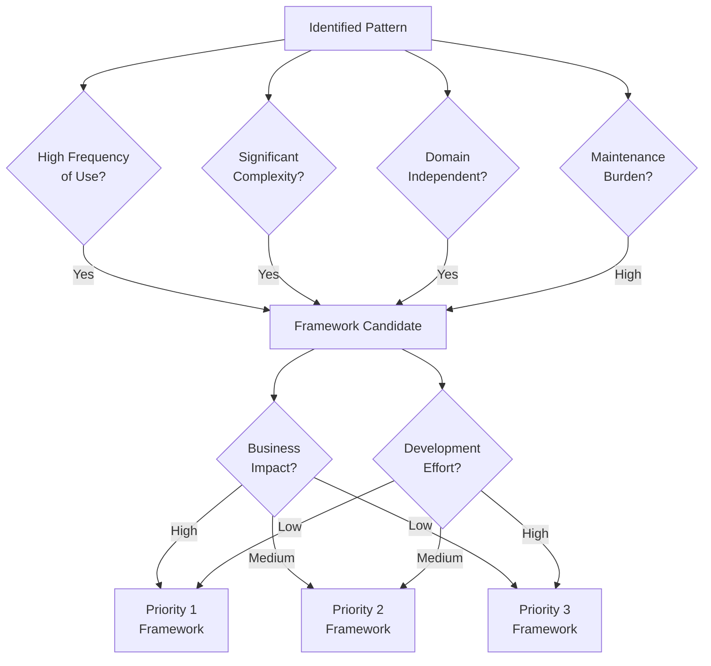
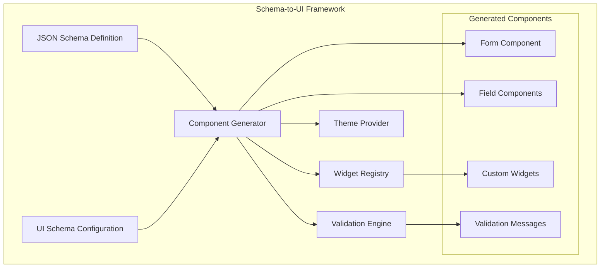
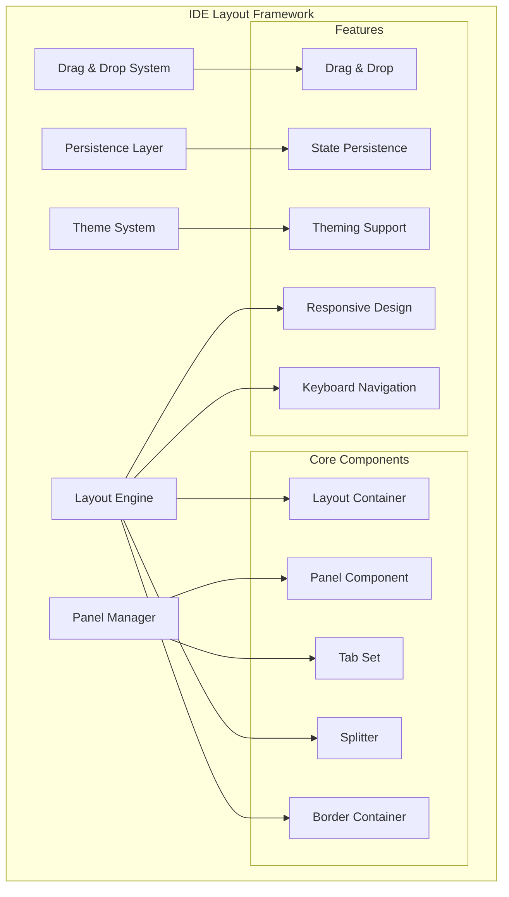
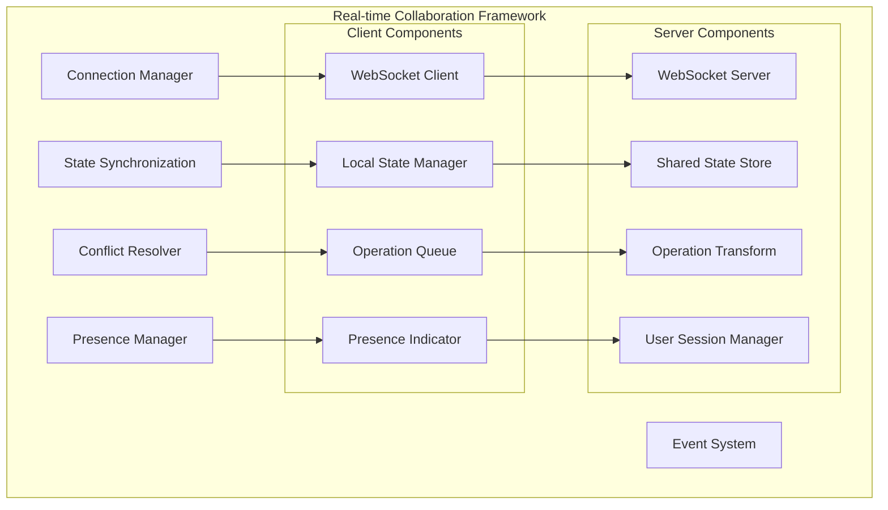
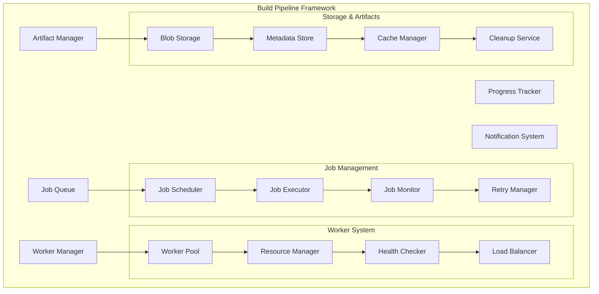
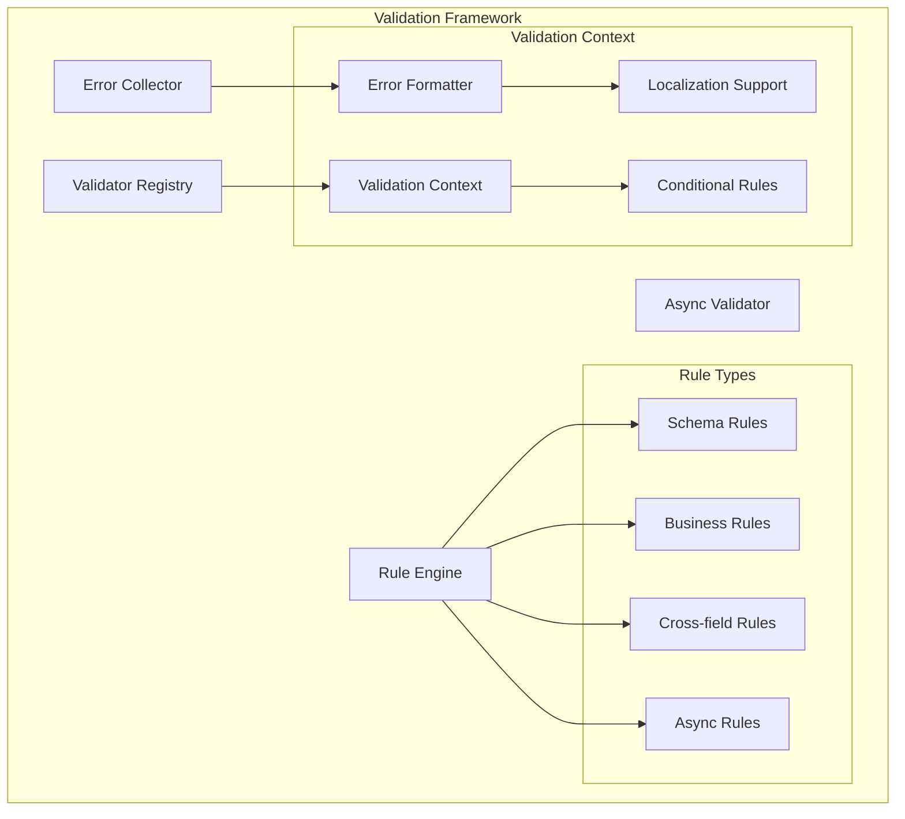
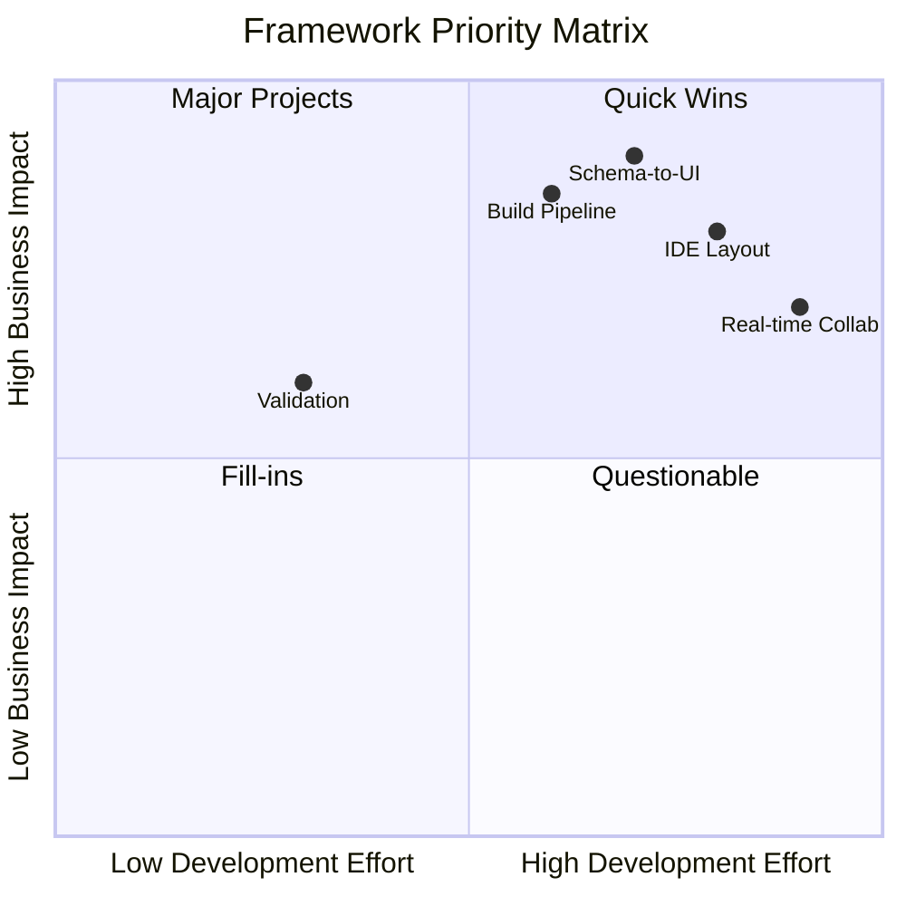
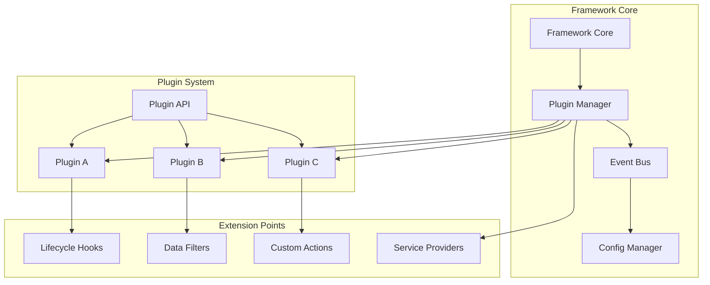
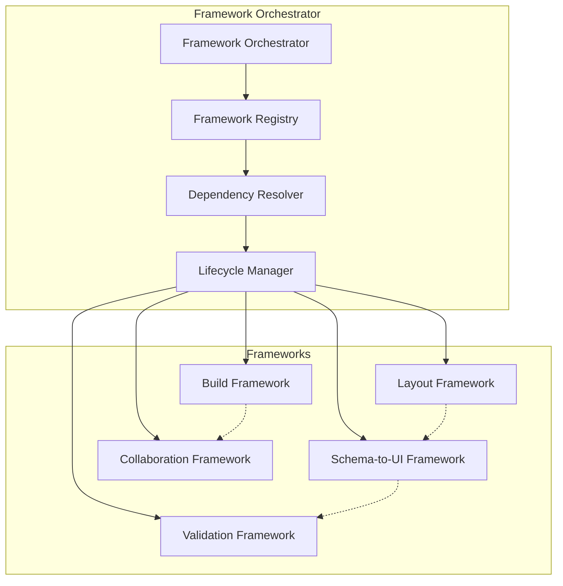

# Reusable Patterns & Framework Opportunities

This document identifies the key patterns within BBOS that can be extracted into reusable frameworks, benefiting other projects in the ecosystem.

## Overview

Through the development of BBOS, we've identified several recurring patterns that appear across different domains and use cases. These patterns represent opportunities to create generic, reusable frameworks that can accelerate development of similar applications.

## Pattern Analysis Framework

### Pattern Evaluation Criteria



## Identified Framework Patterns

### 1. Schema-to-UI Framework ⭐⭐⭐

**Problem Statement**: Manually creating forms for complex JSON schemas is time-consuming and error-prone.

**Pattern Description**: Automatic generation of React components from JSON Schema definitions with customizable UI schemas.

**Reusability Assessment**:
- **Frequency**: Very High - Every data-driven application needs forms
- **Complexity**: High - Schema parsing, component generation, validation
- **Domain Independence**: Very High - Applicable to any JSON Schema use case
- **Maintenance**: High - Complex validation rules and UI customization

**Framework Components**:



**API Design**:
```typescript
interface SchemaToUIFramework {
  generateForm<T>(schema: JSONSchema7, options?: FormOptions): FormComponent<T>;
  registerWidget(name: string, widget: WidgetComponent): void;
  registerTheme(theme: ThemeDefinition): void;
  createUISchema(schema: JSONSchema7): UISchema;
}

// Usage
const framework = new SchemaToUIFramework();
const ArmbianForm = framework.generateForm(armbianSchema, {
  theme: 'material',
  validation: 'real-time',
  layout: 'wizard'
});
```

**Business Impact**: Very High - Reduces form development time by 80-90%

### 2. IDE Layout Framework ⭐⭐⭐

**Problem Statement**: Creating flexible, persistent, IDE-style interfaces requires complex state management and UI coordination.

**Pattern Description**: Dockable panel system with drag-and-drop, persistence, and customizable layouts.

**Reusability Assessment**:
- **Frequency**: High - Many complex applications need IDE-style interfaces
- **Complexity**: Very High - Layout algorithms, persistence, drag-and-drop
- **Domain Independence**: Very High - Applicable to dashboards, IDEs, admin panels
- **Maintenance**: Medium - Stable once implemented

**Framework Components**:



**API Design**:
```typescript
interface IDELayoutFramework {
  createLayout(config: LayoutConfig): LayoutManager;
  registerPanel(id: string, component: PanelComponent): void;
  persistLayout(layoutId: string, storage: StorageProvider): void;
  restoreLayout(layoutId: string, storage: StorageProvider): LayoutConfig;
}

// Usage
const layoutFramework = new IDELayoutFramework();
const layout = layoutFramework.createLayout({
  type: 'border',
  children: [
    { type: 'panel', id: 'sidebar', location: 'left' },
    { type: 'tabset', location: 'center', children: [...] }
  ]
});
```

**Business Impact**: High - Enables complex UIs, improves user productivity

### 3. Real-time Collaboration Framework ⭐⭐

**Problem Statement**: Implementing real-time multi-user features requires complex conflict resolution and synchronization.

**Pattern Description**: WebSocket-based real-time updates with operational transformation and user presence.

**Reusability Assessment**:
- **Frequency**: Medium-High - Growing demand for collaborative features
- **Complexity**: Very High - Conflict resolution, state synchronization
- **Domain Independence**: High - Applicable to any collaborative application
- **Maintenance**: High - Complex synchronization logic

**Framework Components**:



**API Design**:
```typescript
interface CollaborationFramework {
  createSession<T>(documentId: string, initialState: T): CollaborativeSession<T>;
  registerOperation(name: string, transform: OperationTransform): void;
  enablePresence(config: PresenceConfig): PresenceManager;
}

// Usage
const collaboration = new CollaborationFramework();
const session = collaboration.createSession('config-123', initialConfig);
session.on('change', (operation) => applyOperation(operation));
```

**Business Impact**: Medium-High - Enables collaboration, increases user engagement

### 4. Build Pipeline Framework ⭐⭐⭐

**Problem Statement**: Creating robust, monitored build pipelines with queue management and artifact handling.

**Pattern Description**: Extensible job queue system with worker management, progress tracking, and artifact storage.

**Reusability Assessment**:
- **Frequency**: Very High - Every CI/CD system needs this
- **Complexity**: High - Queue management, worker coordination, monitoring
- **Domain Independence**: Very High - Applicable to any build/processing system
- **Maintenance**: Medium - Well-defined interfaces

**Framework Components**:



**API Design**:
```typescript
interface BuildPipelineFramework {
  createPipeline(config: PipelineConfig): Pipeline;
  registerWorker(type: string, worker: WorkerDefinition): void;
  scheduleJob(job: JobDefinition): Promise<JobResult>;
  monitorJob(jobId: string): JobMonitor;
}

// Usage
const pipeline = framework.createPipeline({
  workers: { armbian: { concurrency: 4 } },
  storage: { type: 's3', bucket: 'artifacts' }
});
const job = await pipeline.scheduleJob({
  type: 'armbian',
  config: armbianConfig
});
```

**Business Impact**: Very High - Core to CI/CD, reduces infrastructure complexity

### 5. Validation Framework ⭐⭐

**Problem Statement**: Complex validation rules across different layers (client, server, business logic).

**Pattern Description**: Pluggable validation system with rule composition and custom validators.

**Reusability Assessment**:
- **Frequency**: Very High - Every application needs validation
- **Complexity**: Medium - Rule composition, error handling
- **Domain Independence**: Very High - Universal need
- **Maintenance**: Low - Stable interfaces

**Framework Components**:



**API Design**:
```typescript
interface ValidationFramework {
  createValidator<T>(rules: ValidationRules<T>): Validator<T>;
  registerRule(name: string, rule: ValidationRule): void;
  validateAsync<T>(data: T, context?: ValidationContext): Promise<ValidationResult>;
}

// Usage
const validator = framework.createValidator({
  board: [required(), oneOf(supportedBoards)],
  users: [minLength(1), arrayOf(userSchema)]
});
const result = await validator.validateAsync(configData);
```

**Business Impact**: Medium - Improves data quality, reduces errors

## Framework Priority Matrix



## Implementation Roadmap

### Phase 1: Foundation Frameworks (Q1-Q2)
1. **Validation Framework** - Low effort, immediate utility
2. **Schema-to-UI Framework** - High impact, foundational

### Phase 2: Core Frameworks (Q2-Q3)
3. **Build Pipeline Framework** - Critical for core functionality
4. **IDE Layout Framework** - Key differentiator

### Phase 3: Advanced Frameworks (Q3-Q4)
5. **Real-time Collaboration Framework** - Complex but high value

## Framework Architecture Patterns

### Plugin Architecture



### Dependency Injection Pattern

```typescript
interface FrameworkContainer {
  register<T>(token: string, factory: () => T): void;
  resolve<T>(token: string): T;
  singleton<T>(token: string, factory: () => T): void;
}

// Framework usage
const container = new FrameworkContainer();
container.singleton('validator', () => new SchemaValidator());
container.register('storage', () => new LocalStorage());

const validator = container.resolve<Validator>('validator');
```

### Configuration-Driven Architecture

```typescript
interface FrameworkConfig {
  plugins: PluginConfig[];
  providers: ProviderConfig[];
  features: FeatureFlags;
  performance: PerformanceConfig;
}

// Framework initialization
const framework = new Framework({
  plugins: [
    { name: 'validation', config: { strict: true } },
    { name: 'persistence', config: { storage: 'localStorage' } }
  ],
  features: {
    realTime: true,
    collaboration: false
  }
});
```

## Cross-Framework Integration

### Shared Interfaces

```typescript
// Common interfaces across frameworks
interface FrameworkBase {
  readonly name: string;
  readonly version: string;
  initialize(config: FrameworkConfig): Promise<void>;
  destroy(): Promise<void>;
}

interface EventEmitter {
  on(event: string, handler: Function): void;
  emit(event: string, data: any): void;
  off(event: string, handler: Function): void;
}

interface Configurable {
  configure(config: Partial<FrameworkConfig>): void;
  getConfig(): FrameworkConfig;
}
```

### Framework Orchestration



## Benefits Analysis

### Development Velocity
- **50-80% reduction** in boilerplate code
- **Consistent patterns** across projects
- **Reduced learning curve** for new developers
- **Faster time-to-market** for new features

### Quality Improvements
- **Battle-tested components** with fewer bugs
- **Consistent UX patterns** across applications
- **Better test coverage** through framework testing
- **Security best practices** built-in

### Maintenance Benefits
- **Centralized updates** across all projects
- **Reduced technical debt** through standardization
- **Easier debugging** with familiar patterns
- **Better documentation** and examples

## Success Metrics

### Framework Adoption
- Number of projects using each framework
- Lines of code reduction compared to custom implementation
- Developer satisfaction scores
- Time-to-implementation metrics

### Quality Metrics
- Bug reports per framework
- Security vulnerability counts
- Performance benchmarks
- API stability metrics

### Business Metrics
- Reduced development costs
- Faster feature delivery
- Improved user satisfaction
- Market differentiation

## Next Steps

1. **Framework Design Phase**: Create detailed specifications for Priority 1 frameworks
2. **Prototype Development**: Build minimal viable versions for validation
3. **Community Feedback**: Gather input from potential users
4. **Production Implementation**: Build production-ready versions
5. **Documentation & Training**: Create comprehensive guides and examples
6. **Ecosystem Development**: Build tooling and extensions

---

These frameworks represent a significant opportunity to create reusable value that extends far beyond BBOS, potentially serving the broader development community while establishing technical leadership in the IoT platform space.